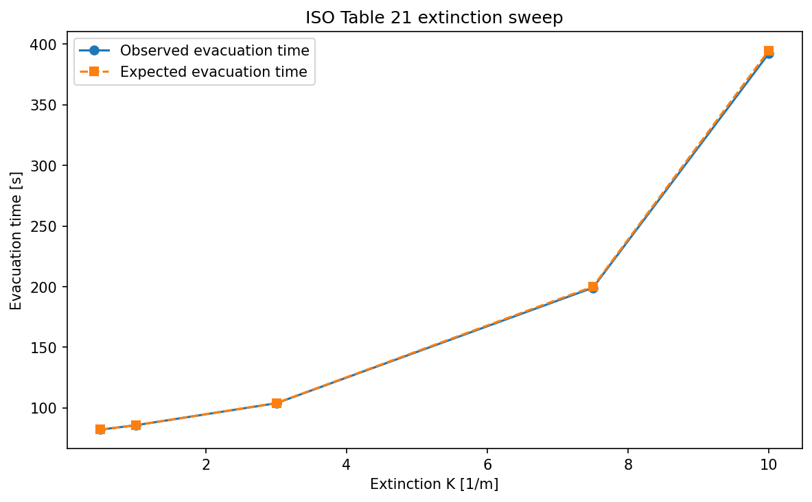

[](https://github.com/PedestrianDynamics/fds-evac/actions/workflows/code-quality.yml)
[](https://github.com/PedestrianDynamics/pyFDS-Evac/actions/workflows/tests.yml)

# pyFDS-Evac

Fire Dynamics Simulator (FDS) coupled evacuation modeling with smoke-speed reduction, toxic gas dose (FED), and dynamic route rerouting.

The project includes:

- Smoke-speed model (visibility/extinction-based speed reduction)
- Full ISO 13571 FED model (toxic gas dose accumulation)
- Dynamic smoke-based route rerouting
- JuPedSim scenario loading and simulation


## Installation

This project uses [uv](https://github.com/astral-sh/uv) for dependency management.

```bash
uv sync
```

## Development

Activate the virtual environment:

```bash
uv shell
```

Run a JSON-first scenario with the CLI runner:

```bash
uv run run.py --scenario assets/ISO-table21 --cleanup
```

## Smoke-Speed Model

The smoke-speed model uses extinction coefficient `K [1/m]` as the primary
input. For real FDS output, `fdsvismap` provides the local extinction field.
For verification cases such as ISO 20414 Table 21, the runner can also apply a
constant extinction coefficient directly.

### FDS Data Access Layers

The project uses two different FDS readers on purpose:

- `fdsvismap`
  - used for extinction / visibility-centric workflows
  - current use: smoke-speed (`K [1/m]`) and visibility-related logic
- `fdsreader`
  - used for generic raw FDS quantities
  - current use: Table 22 / FED inputs such as `CO`, `CO2`, and `O2`

Rule of thumb:

- use `fdsvismap` for smoke/visibility
- use `fdsreader` for gases and other hazard quantities

Run the ISO Table 21 corridor with a constant extinction coefficient:

```bash
uv run run.py \
  --scenario assets/ISO-table21 \
  --constant-extinction 1.0 \
  --smoke-update-interval 0.1 \
  --output-smoke-history /tmp/iso-table21-smoke-history.csv \
  --cleanup
```

Run the smoke-speed model against FDS results read through `fdsvismap`:

```bash
uv run run.py \
  --scenario assets/ISO-table21 \
  --fds-dir fds_data \
  --smoke-update-interval 0.1 \
  --output-smoke-history /tmp/iso-table21-fds-smoke-history.csv \
  --cleanup
```

Inspect the FDS quantities available through `fdsreader`:

```bash
uv run run.py --inspect-fds --fds-dir fds_data --scenario assets/ISO-table21
```

Plot smoke-speed history for a single agent:

```bash
uv run python scripts/plot_smoke_history.py \
  --input /tmp/iso-table21-smoke-history.csv \
  --output /tmp/iso-table21-smoke-history.png \
  --agent-id 1
```

Plot aggregate smoke-speed history:

```bash
uv run python scripts/plot_smoke_history.py \
  --input /tmp/iso-table21-smoke-history.csv \
  --output /tmp/iso-table21-smoke-history-aggregate.png
```

Generate a stable ISO Table 21 sweep artifact under `artifacts/`:

```bash
uv run python scripts/generate_iso_table21_sweep.py
```

Figure: 

Generate the FDS+Evac smoke-density vs speed verification plot:

```bash
uv run python scripts/generate_smoke_density_speed_plot.py
```

## FED Model (Fractional Effective Dose)

The FED model implements the full ISO 13571 / Purser formulation as
described in Section 3.4 of the
[FDS+Evac Technical Reference and User's Guide](materials/FDS+EVAC_Guide.pdf)
(Korhonen, 2021).

### Implemented equation (guide Eq. 12)

$$
\mathrm{FED}_{\mathrm{tot}} = \bigl(\mathrm{FED}_{\mathrm{CO}} + \mathrm{FED}_{\mathrm{CN}} + \mathrm{FED}_{\mathrm{NO_x}} + \mathrm{FLD}_{\mathrm{irr}}\bigr) \times \mathrm{HV}_{\mathrm{CO_2}} + \mathrm{FED}_{\mathrm{O_2}}
$$

| Term | Guide Eq. | Formula | Input |
|------|-----------|---------|-------|
| FED_CO | (13) | $\int 2.764 \times 10^{-5}\, C_{\mathrm{CO}}^{1.036}\, dt$ | CO (ppm) |
| FED_CN | (14-15) | $\int \bigl(\exp(C_{\mathrm{CN}}/43)/220 - 0.0045\bigr)\, dt$, where $C_{\mathrm{CN}} = C_{\mathrm{HCN}} - C_{\mathrm{NO_2}}$ | HCN, NO2 (ppm) |
| FED_NOx | (16) | $\int C_{\mathrm{NO_x}}/1500\, dt$, where $C_{\mathrm{NO_x}} = C_{\mathrm{NO}} + C_{\mathrm{NO_2}}$ | NO, NO2 (ppm) |
| FLD_irr | (17) | $\int \sum_i C_i / F_{\mathrm{FLD},i}\, dt$ | HCl, HBr, HF, SO2, NO2, acrolein, formaldehyde (ppm) |
| HV_CO2 | (19) | $\exp(0.1903\, C_{\mathrm{CO_2}} + 2.0004)/7.1$ | CO2 (vol %) |
| FED_O2 | (18) | $\int 1/\bigl(60\, \exp(8.13 - 0.54\,(20.9 - C_{\mathrm{O_2}}))\bigr)\, dt$ | O2 (vol %) |

Irritant Ct values (ppm·min) from guide Table 2:

| Species | HCl | HBr | HF | SO2 | NO2 | acrolein | formaldehyde |
|---------|------|------|------|------|------|----------|--------------|
| F_FLD | 114000 | 114000 | 87000 | 12000 | 1900 | 4500 | 22500 |

Gas species are read from FDS slice outputs via `fdsreader`. Required
species: CO, CO2, O2. Optional species (HCN, NO, NO2, HCl, HBr, HF,
SO2, acrolein, formaldehyde) are loaded when available; missing species
default to 0 and contribute nothing to the FED sum. With only the three
required species, the model reduces to the original FDS+Evac default
pathway: $\mathrm{FED}_{\mathrm{CO}} \cdot \mathrm{HV}_{\mathrm{CO_2}} + \mathrm{FED}_{\mathrm{O_2}}$.

### Verification

- Equation-level constant-exposure checks for all terms are covered in [tests/test_fed.py](tests/test_fed.py)
- An ISO Table 22 style stationary benchmark is covered with `assets/ISO-table22`, comparing the runtime `FED=1` crossing time against the analytical reference

Generate the ISO Table 22 stationary FED verification figure:

```bash
uv run python scripts/generate_iso_table22_stationary_plot.py
```

Figure: 

### What is not implemented yet

- Incapacitation effects on agent motion (FED >= 1 → speed = 0)
- Thermal FED terms (radiant heat, convective heat)

### Usage

Inspect which local FDS cases support FED:

```bash
uv run python - <<'PY'
from src.core import inspect_fds_quantities, list_simulations
for path in list_simulations("fds_data"):
    inv = inspect_fds_quantities(path)
    print(path, inv.canonical_slice_names(), inv.supports_default_fed())
PY
```

Run a scenario with FED accumulation from FDS data:

```bash
uv run run.py \
  --scenario assets/ISO-table21 \
  --fds-dir fds_data/haspel \
  --smoke-slice-height 2.1 \
  --smoke-update-interval 1.0 \
  --output-fed-history /tmp/iso-fed-history.csv \
  --cleanup
```

Note: if a point lies outside the FDS domain, the implementation falls back to ambient conditions.

## References

Reference materials are stored in [`materials/`](materials/):

- [FDS+Evac Technical Reference and User's Guide](materials/FDS+EVAC_Guide.pdf) — Korhonen (2021). Primary reference for the FED equations (Section 3.4) and smoke-speed model (Section 3.4, Eq. 11).
- [Schroder et al. (2020)](materials/Schroder2020.pdf) — Waypoint-based visibility and evacuation modeling.
- [Ronchi et al. (2013)](materials/Ronchi2013.pdf) — FDS+Evac evacuation model validation and verification.
- [evac.f90](materials/evac.f90) — Original FDS+Evac Fortran source for cross-referencing implementation details.

## Dependencies

- jupedsim
- pedpy
- fdsvismap
- plotly
- nbformat
