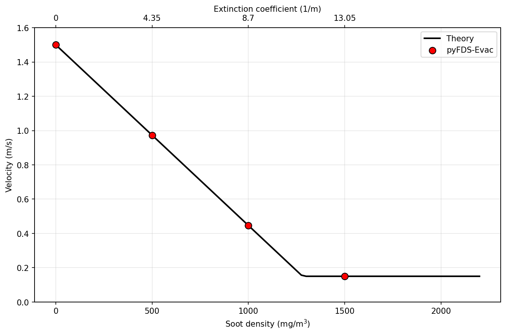
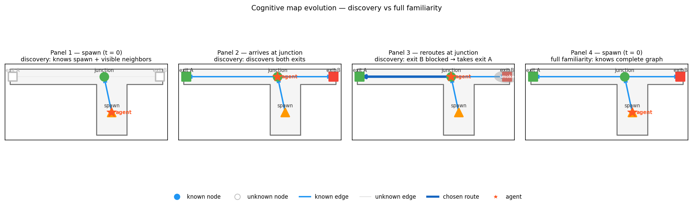

[](https://github.com/PedestrianDynamics/pyFDS-Evac/actions/workflows/code-quality.yml)
[](https://github.com/PedestrianDynamics/pyFDS-Evac/actions/workflows/tests.yml)

# pyFDS-Evac

Fire Dynamics Simulator (FDS) coupled evacuation modeling with smoke-speed reduction, toxic gas dose (FED), and dynamic route rerouting.

The project includes:

- Smoke-speed model (visibility/extinction-based speed reduction)
- Full ISO 13571 FED model (toxic gas dose accumulation)
- Dynamic smoke-based route rerouting with congestion awareness
- Sign-visibility-gated route rejection (fdsvismap integration)
- Per-agent cognitive maps with `full` and `discovery` familiarity tiers
- JuPedSim scenario loading and simulation

## Installation

This project uses [uv](https://github.com/astral-sh/uv) for dependency management.

```bash
uv sync
```

## Development

Activate the virtual environment:

```bash
uv shell
```

Run a JSON-first scenario with the CLI runner:

```bash
uv run run.py --scenario assets/ISO-table21 --cleanup
```

## Smoke-speed model

See [docs/smoke-speed-model.md](docs/smoke-speed-model.md) for the full
model description, configuration, and API reference.

The smoke-speed model uses extinction coefficient `K [1/m]` as the primary
input. For real FDS output, `fdsreader` provides the local extinction field
via `SliceFieldSampler`. For verification cases such as ISO 20414 Table 21,
the runner can also apply a constant extinction coefficient directly.

### FDS data access

All FDS slice data is read through a single library:

- **`fdsreader`** — reads raw FDS slice quantities with nearest-neighbor
  spatial and temporal lookup via `SliceFieldSampler`
  (`pyfds_evac/core/fds_sampling.py`)
- Used by both the smoke-speed model (extinction `K [1/m]`) and the FED
  model (CO, CO2, O2, and optional irritant gases)
- When a scenario needs both extinction and FED fields from the same FDS
  case, pass a shared `fdsreader.Simulation` instance to avoid parsing
  the directory twice (see [FDS sampling API](docs/fds-sampling.md))

Run the ISO Table 21 corridor with a constant extinction coefficient:

```bash
uv run run.py \
  --scenario assets/ISO-table21 \
  --constant-extinction 1.0 \
  --smoke-update-interval 0.1 \
  --output-smoke-history /tmp/iso-table21-smoke-history.csv \
  --cleanup
```

Run the smoke-speed model against FDS results read through `fdsreader`:

```bash
uv run run.py \
  --scenario assets/ISO-table21 \
  --fds-dir fds_data \
  --smoke-update-interval 0.1 \
  --output-smoke-history /tmp/iso-table21-fds-smoke-history.csv \
  --cleanup
```

Inspect the FDS quantities available through `fdsreader`:

```bash
uv run run.py --inspect-fds --fds-dir fds_data --scenario assets/ISO-table21
```

Plot smoke-speed history for a single agent:

```bash
uv run python scripts/plot_smoke_history.py \
  --input /tmp/iso-table21-smoke-history.csv \
  --output /tmp/iso-table21-smoke-history.png \
  --agent-id 1
```

Plot aggregate smoke-speed history:

```bash
uv run python scripts/plot_smoke_history.py \
  --input /tmp/iso-table21-smoke-history.csv \
  --output /tmp/iso-table21-smoke-history-aggregate.png
```

Generate a stable ISO Table 21 sweep artifact under `artifacts/`:

```bash
uv run python scripts/generate_iso_table21_sweep.py
```

Figure: 

Generate the FDS+Evac smoke-density vs speed verification plot:

```bash
uv run python scripts/generate_smoke_density_speed_plot.py
```

Figure: 


## FED Model (Fractional Effective Dose)

The FED model implements the full ISO 13571 / Purser formulation as
described in Section 3.4 of the
[FDS+Evac Technical Reference and User's Guide](materials/FDS+EVAC_Guide.pdf)
(Korhonen, 2021).

### Implemented equation (guide Eq. 12)

$$
\mathrm{FED}_{\mathrm{tot}} = \bigl(\mathrm{FED}_{\mathrm{CO}} + \mathrm{FED}_{\mathrm{CN}} + \mathrm{FED}_{\mathrm{NO_x}} + \mathrm{FLD}_{\mathrm{irr}}\bigr) \times \mathrm{HV}_{\mathrm{CO_2}} + \mathrm{FED}_{\mathrm{O_2}}
$$

| Term | Guide Eq. | Formula | Input |
|------|-----------|---------|-------|
| FED_CO | (13) | $\int 2.764 \times 10^{-5}\, C_{\mathrm{CO}}^{1.036}\, dt$ | CO (ppm) |
| FED_CN | (14-15) | $\int \bigl(\exp(C_{\mathrm{CN}}/43)/220 - 0.0045\bigr)\, dt$, where $C_{\mathrm{CN}} = C_{\mathrm{HCN}} - C_{\mathrm{NO_2}}$ | HCN, NO2 (ppm) |
| FED_NOx | (16) | $\int C_{\mathrm{NO_x}}/1500\, dt$, where $C_{\mathrm{NO_x}} = C_{\mathrm{NO}} + C_{\mathrm{NO_2}}$ | NO, NO2 (ppm) |
| FLD_irr | (17) | $\int \sum_i C_i / F_{\mathrm{FLD},i}\, dt$ | HCl, HBr, HF, SO2, NO2, acrolein, formaldehyde (ppm) |
| HV_CO2 | (19) | $\exp(0.1903\, C_{\mathrm{CO_2}} + 2.0004)/7.1$ | CO2 (vol %) |
| FED_O2 | (18) | $\int 1/\bigl(60\, \exp(8.13 - 0.54\,(20.9 - C_{\mathrm{O_2}}))\bigr)\, dt$ | O2 (vol %) |

Irritant Ct values (ppm·min) from guide Table 2:

| Species | HCl | HBr | HF | SO2 | NO2 | acrolein | formaldehyde |
|---------|------|------|------|------|------|----------|--------------|
| F_FLD | 114000 | 114000 | 87000 | 12000 | 1900 | 4500 | 22500 |

Gas species are read from FDS slice outputs via `fdsreader`. Required
species: CO, CO2, O2. Optional species (HCN, NO, NO2, HCl, HBr, HF,
SO2, acrolein, formaldehyde) are loaded when available; missing species
default to 0 and contribute nothing to the FED sum. With only the three
required species, the model reduces to the original FDS+Evac default
pathway: `FED_CO * HV_CO2 + FED_O2`.

### Recent additions

The FED model was extended in March 2026 to include all ISO 13571 terms:

- **HCN (hydrogen cyanide) and NO2 (nitrogen dioxide)**: CN-term for narcosis,
  where NO2 has a protective effect (C_CN = C_HCN - C_NO2)
- **NO (nitric oxide)**: Added to NOx-term alongside NO2
- **Multiple irritant gases**: HCl, HBr, HF, SO2, NO2, acrolein, formaldehyde
  with species-specific Ct thresholds from guide Table 2

All new terms are fully tested with constant-exposure unit tests in
`tests/test_fed.py`.

### Verification

- Equation-level constant-exposure checks for all ISO 13571 terms are covered in
  [tests/test_fed.py](tests/test_fed.py)
- An ISO Table 22 style stationary benchmark is covered with `assets/ISO-table22`,
  comparing the runtime `FED=1` crossing time against the analytical reference

Generate the ISO Table 22 stationary FED verification figure:

```bash
uv run python scripts/generate_iso_table22_stationary_plot.py
```

Figure: 

### What is not implemented yet

- Incapacitation effects on agent motion (FED >= 1 → speed = 0)
- Thermal FED terms (radiant heat, convective heat)

### Usage

Inspect which local FDS cases support FED:

```bash
uv run python - <<'PY'
from pyfds_evac.core import inspect_fds_quantities, list_simulations
for path in list_simulations("fds_data"):
    inv = inspect_fds_quantities(path)
    print(path, inv.canonical_slice_names(), inv.supports_default_fed())
PY
```

Run a scenario with FED accumulation from FDS data:

```bash
uv run run.py \
  --scenario assets/ISO-table21 \
  --fds-dir fds_data/haspel \
  --smoke-slice-height 2.1 \
  --smoke-update-interval 1.0 \
  --output-fed-history /tmp/iso-fed-history.csv \
  --cleanup
```

Note: if a point lies outside the FDS domain, the implementation falls back to ambient conditions.

## Dynamic route rerouting

See [docs/routing.md](docs/routing.md) for the full routing model,
cost formulas, and API reference.

The routing system implements smoke-aware path planning with dynamic rerouting:

- **StageGraph**: Dijkstra-based shortest-path routing on a graph of
  stages (distributions, checkpoints, exits)
- **Route cost evaluation**: Samples extinction (K) along candidate paths
  to compute smoke exposure (FED terms are supported when a `fed_model`
  is provided; otherwise only smoke drives ranking)
- **Dynamic rerouting**: Agents recompute routes at configurable intervals,
  selecting lower-exposure paths when available
- **Congestion-aware routing**: Optional exit-congestion term (`w_queue`)
  balances load across exits based on current agent counts and capacities
- **Throughput throttling**: Optional exit flux limiting via
  `enable_throughput_throttling` and `max_throughput` in scenario config

### Usage

Run the haspel scenario with smoke-aware rerouting:

```bash
uv run run.py \
  --scenario assets/haspel \
  --fds-dir fds_data/haspel \
  --smoke-update-interval 1.0 \
  --reroute-interval 30.0 \
  --output-fed-history /tmp/haspel-fed-history.csv \
  --cleanup
```

## Visibility-aware routing and cognitive maps

Implements [Spec 008](specs/008-visibility-aware-routing/SPEC.md): sign
visibility gates route rejection and per-agent cognitive maps control what
knowledge each agent has about the building layout.

### Sign visibility (Phase 1)

Each exit and checkpoint can carry a `"sign"` descriptor in the scenario
config:

```json
{
  "exits": {
    "exit_A": {
      "sign": {"x": 0.5, "y": 11.5, "alpha": 90, "c": 3}
    }
  }
}
```

`alpha` is a compass bearing (degrees from north, clockwise): 90 = sign
visible from the east, 270 = from the west, 180 = from the south.

At each reevaluation tick the `VisibilityModel` checks whether an agent
can see the next node's sign using a cached [fdsvismap](https://github.com/FireDynamics/fdsvismap)
pickle. If the sign is not visible, the route is rejected with
`rejection_reason="next_node_not_visible"`.

```bash
# Build or reuse the vismap cache and enable visibility-gated rejection
uv run run.py \
  --scenario assets/demo \
  --fds-dir fds_data/demo \
  --enable-rerouting \
  --vis-cache fds_data/demo/vismap_cache.pkl \
  --output-route-cost-history route_costs.csv \
  --cleanup
```

Rejected routes are recorded in the route-cost CSV with
`rejected=True, rejection_reason=next_node_not_visible`.

#### Diagnostic scripts

```bash
# Coverage and ASET maps (sign placement validation)
uv run python scripts/demo_vismap_phase0.py

# With fresh vismap recompute
uv run python scripts/demo_vismap_phase0.py --no-cache
```

### Cognitive maps (Phase 2)

Agents have a familiarity tier that controls how much of the building they
know at the start of the simulation:

| Tier | `familiarity` | Knowledge at spawn | Expansion |
|------|---------------|--------------------|-----------|
| Trained staff | `"full"` | Complete stage graph | — |
| Visitors | `"discovery"` | Spawn node + visible neighbors | On arrival + at reevaluation |

Set per distribution group in the scenario config:

```json
{
  "distributions": {
    "visitors": {
      "parameters": {
        "familiarity": "discovery"
      }
    }
  }
}
```

Default when the key is absent: `"full"` (backward compatible).

**Discovery expansion rules:**

1. **At spawn** — agent learns its spawn node plus any adjacent node whose
   sign is currently visible from the spawn centroid.
2. **On arrival** — when an agent physically reaches a node, all immediate
   neighbours are added to the cognitive map unconditionally.
3. **At reevaluation** — adjacent nodes whose sign is visible from the
   agent's current position are added.

Routing (Dijkstra) runs over the agent's known sub-graph only. If no exit
is reachable in the cognitive map, the agent navigates toward the nearest
visible node.

#### Visualising cognitive map evolution

```bash
# 4-panel figure: spawn → junction → reroute → full baseline
uv run python scripts/demo_cognitive_map_vis.py

# Without cached vismap (all neighbours assumed visible at spawn)
uv run python scripts/demo_cognitive_map_vis.py --no-cache
```

Figure: 

### Phase 2 verification: familiarity comparison

Two scenario configs differ only in familiarity tier:

| Config | Tier |
|--------|------|
| `assets/demo/config_full.json` | `familiarity=full` |
| `assets/demo/config_discovery.json` | `familiarity=discovery` |

Run both back-to-back and produce a 3-panel comparison (exit split,
rejection timeline, evacuation time):

```bash
uv run python scripts/run_familiarity_comparison.py \
    --fds-dir fds_data/demo \
    --vis-cache fds_data/demo/vismap_cache.pkl
```

Outputs: `results/familiarity_comparison/{full,discovery}_route_costs.csv`,
`results/familiarity_comparison/comparison.png`.

## References

Reference materials are stored in [`materials/`](materials/):

- [FDS+Evac Technical Reference and User's Guide](materials/FDS+EVAC_Guide.pdf) — Korhonen (2021). Primary reference for the FED equations (Section 3.4) and smoke-speed model (Section 3.4, Eq. 11).
- [Boerger et al. (2024)](materials/waypoint_based_visibility.pdf) — Beer-Lambert integrated extinction along line of sight (Eq. 8-9), waypoint-based visibility maps. *Fire Safety Journal* 150:104269.
- [Haensel (2014)](materials/Haensel2014.pdf) — Knowledge-based routing and cognitive map framework for evacuation modelling.
- [Schroder et al. (2020)](materials/Schroder2020.pdf) — Waypoint-based visibility and evacuation modeling.
- [Ronchi et al. (2013)](materials/Ronchi2013.pdf) — FDS+Evac evacuation model validation and verification.
- [evac.f90](materials/evac.f90) — Original FDS+Evac Fortran source for cross-referencing implementation details.

## Assets

Scenario definitions are stored in [`assets/`](assets/):

- **ISO-table21**: ISO 20414 corridor verification case (single exit)
- **ISO-table22**: ISO 20414 stationary benchmark (single agent, analytical FED=1 time)
- **haspel**: Multi-exit scenario with three zones and dynamic rerouting
- **demo**: T-corridor FDS scenario with cable fire, two exits (A open, B smoke-accumulating),
  200 visitors spawning in the branch; used for visibility-aware routing and cognitive
  map verification (Spec 008). Includes `config_full.json` and `config_discovery.json`
  for familiarity-tier comparison.
- **basic**: Minimal scenarios for smoke-speed verification
- **HC**: Hazard composition cases
- **social_force**: Social force model test cases

## Dependencies

- jupedsim
- pedpy
- fdsreader
- plotly
- nbformat
