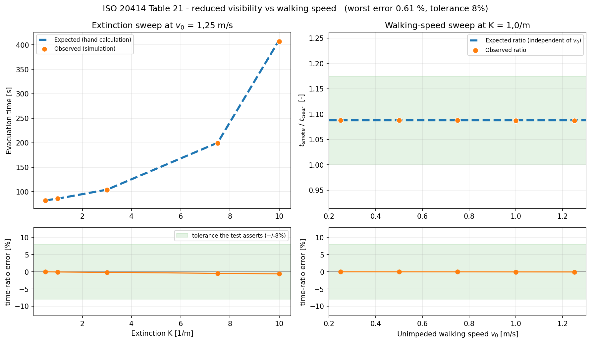
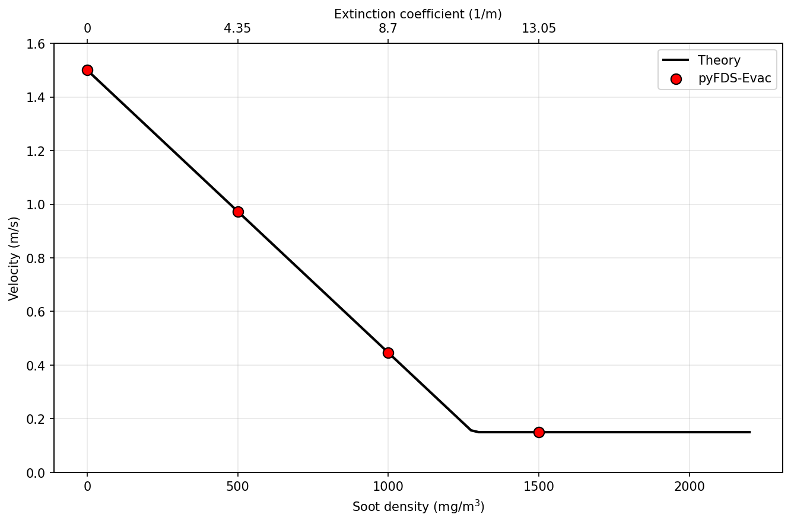
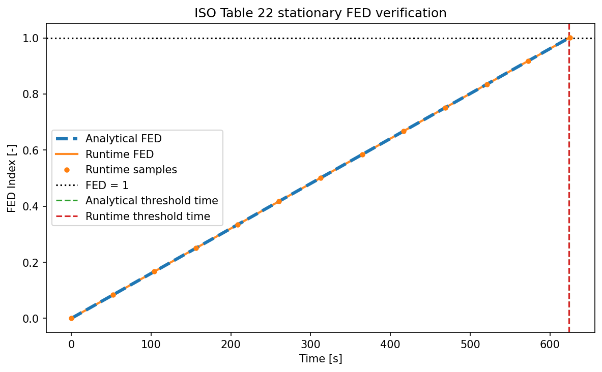
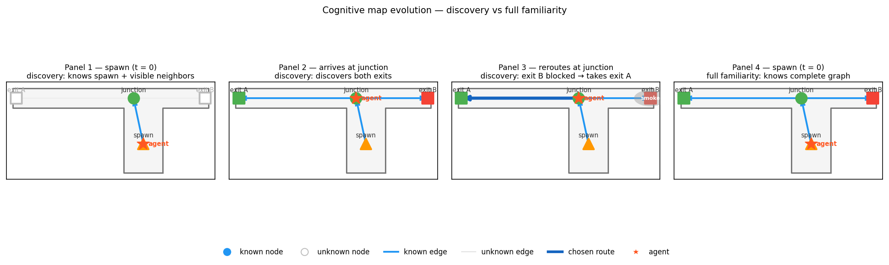

[](https://github.com/PedestrianDynamics/pyFDS-Evac/actions/workflows/code-quality.yml)
[](https://github.com/PedestrianDynamics/pyFDS-Evac/actions/workflows/tests.yml)

# pyFDS-Evac

Fire Dynamics Simulator (FDS) coupled evacuation modeling with smoke-speed reduction, toxic gas dose (FED), and dynamic route rerouting.

The project includes:

- Smoke-speed model (visibility/extinction-based speed reduction)
- Full ISO 13571 FED model (toxic gas dose accumulation)
- Dynamic smoke-based route rerouting with congestion awareness
- Sign-visibility-gated route rejection (fdsvismap integration)
- Per-agent cognitive maps with `full` and `discovery` familiarity tiers
- JuPedSim scenario loading and simulation

## Installation

This project uses [uv](https://github.com/astral-sh/uv) for dependency management.

```bash
uv sync
```

## Development

Activate the virtual environment:

```bash
uv shell
```

Run a JSON-first scenario with the CLI runner:

```bash
uv run run.py --scenario assets/ISO-table21 --cleanup
```

See [docs/usage.md](docs/usage.md) for the full catalogue of CLI flags,
post-processing scripts, and the `scripts/run_and_plot.sh` driver that
runs a simulation and produces every plot in one go.

**Bringing your own FDS case?** Read
[docs/fds-case-requirements.md](docs/fds-case-requirements.md) first. pyFDS-Evac
does not run FDS, it samples the output of a finished run, and your deck has to
dump specific slices for that to work. That page also covers the `&REAC` yields
those slices depend on, and two failure modes that stay silent otherwise.

## Web GUI

A [FastHTML](https://fastht.ml/) web GUI 
exposes the same model behind a form: pick a scenario, set any `run.py` flag
(the `fds dir` field has a folder browser), run it, watch live progress, and
explore the results.

Two ways to view a finished run's trajectories:

- **Interactive [Plotly](https://plotly.com/python/) charts** — cumulative
  FED, smoke, and route cost over time.
- **Canvas trajectory replay** (`pyfds_evac/webapp/trajviz.py`) — agents
  interpolated smoothly between downsampled trajectory samples, coloured by
  cumulative FED (safe → alert → critical → severe) or by assigned exit, with
  play/pause, a scrub bar, and ¼×–4× playback speed. When the run has an
  `fds_dir`, the FDS extinction slice is drawn as a smoke layer underneath
  the agents (toggleable), sampled via `fdsreader`'s multi-mesh
  `to_global()` and clipped to the walkable polygon.

Install the optional GUI dependencies and launch:

```bash
uv sync --extra gui
uv run app.py
```

Then open <http://localhost:5001>. The GUI calls the same
`run_scenario()` as the CLI (via the shared
`pyfds_evac.core.run_config.build_run_kwargs` option builder), so a run
configured in the browser is identical to the equivalent `run.py`
invocation. Runs execute on a background thread and stream progress over
Server-Sent Events; one run is active at a time.

## Smoke-speed model

See [docs/smoke-speed-model.md](docs/smoke-speed-model.md) for the full
model description, configuration, and API reference.

The smoke-speed model uses extinction coefficient `K [1/m]` as the primary
input. Two speed laws are available, selected via `SmokeSpeedConfig.speed_law`:

| `speed_law` | Model | Reference |
|-------------|-------|-----------|
| `"lund"` (default) | Linear: `speed_factor = 1 + β·K/α`, clamped to `[min_speed_factor, 1]` | Frantzich & Nilsson / FDS+Evac |
| `"fridolf"` | Non-linear: `speed_factor = V / (V + 2)` where `V = C / K` (Jin) | Fridolf et al. (2019) |

The Fridolf law is empirically validated against individual walking-speed
measurements in smoke-filled tunnels and naturally asymptotes to zero without
a hard clamp. Select it with `SmokeSpeedConfig(speed_law="fridolf")`;
`visibility_factor_c` controls the Jin constant (default `3` for reflective
signs, `8` for light-emitting signs).

For real FDS output, `fdsreader` provides the local extinction field
via `SliceFieldSampler`. For verification cases such as ISO 20414 Table 21,
the runner can also apply a constant extinction coefficient directly.

### FDS data access

All FDS slice data is read through a single library:

- **`fdsreader`** — reads raw FDS slice quantities with nearest-neighbor
  spatial and temporal lookup via `SliceFieldSampler`
  (`pyfds_evac/core/fds_sampling.py`)
- Used by both the smoke-speed model (extinction `K [1/m]`) and the FED
  model (CO, CO2, O2, and optional irritant gases)
- When a scenario needs both extinction and FED fields from the same FDS
  case, pass a shared `fdsreader.Simulation` instance to avoid parsing
  the directory twice (see [FDS sampling API](docs/fds-sampling.md))

Run the ISO Table 21 corridor with a constant extinction coefficient:

```bash
uv run run.py \
  --scenario assets/ISO-table21 \
  --constant-extinction 1.0 \
  --smoke-update-interval 0.1 \
  --output-smoke-history /tmp/iso-table21-smoke-history.csv \
  --cleanup
```

Run the smoke-speed model against FDS results read through `fdsreader`. The
repository ships the deck, not its output — the slices are 4.2 MB and the full
run 54 MB — so run FDS once first:

```bash
mkdir -p /tmp/iso21 && cd /tmp/iso21 \
  && fds /path/to/assets/ISO-table21/ISO-table21.fds && cd -   # ~8 min

uv run run.py \
  --scenario assets/ISO-table21 \
  --fds-dir /tmp/iso21 \
  --smoke-update-interval 0.1 \
  --output-smoke-history /tmp/iso-table21-fds-smoke-history.csv \
  --cleanup
```

Inspect the FDS quantities available through `fdsreader`:

```bash
uv run run.py --inspect-fds --fds-dir /tmp/iso21 --scenario assets/ISO-table21
```

For a case where the coupling is exercised without running FDS yourself, see
[`assets/iso_table22_coupled`](assets/iso_table22_coupled/README.md): its output
is committed (136 kB) and a test reads it on every CI run.

Plot smoke-speed history for a single agent:

```bash
uv run python scripts/plot_smoke_history.py \
  --input /tmp/iso-table21-smoke-history.csv \
  --output /tmp/iso-table21-smoke-history.png \
  --agent-id 1
```

Plot aggregate smoke-speed history:

```bash
uv run python scripts/plot_smoke_history.py \
  --input /tmp/iso-table21-smoke-history.csv \
  --output /tmp/iso-table21-smoke-history-aggregate.png
```

Generate a stable ISO Table 21 sweep artifact under `artifacts/`:

```bash
uv run python scripts/generate_iso_table21_sweep.py
```

Figure: 

Generate the FDS+Evac smoke-density vs speed verification plot:

```bash
uv run python scripts/generate_smoke_density_speed_plot.py
```

Figure: 


## FED Model (Fractional Effective Dose)

The FED model implements the full ISO 13571 / Purser formulation as
described in Section 3.4 of the
[FDS+Evac Technical Reference and User's Guide](materials/FDS+EVAC_Guide.pdf)
(Korhonen, 2021).

### Implemented equation (guide Eq. 12)

$$
\mathrm{FED}_{\mathrm{tot}} = \bigl(\mathrm{FED}_{\mathrm{CO}} + \mathrm{FED}_{\mathrm{CN}} + \mathrm{FED}_{\mathrm{NO_x}} + \mathrm{FLD}_{\mathrm{irr}}\bigr) \times \mathrm{HV}_{\mathrm{CO_2}} + \mathrm{FED}_{\mathrm{O_2}}
$$

| Term | Guide Eq. | Formula | Input |
|------|-----------|---------|-------|
| FED_CO | (13) | $\int 2.764 \times 10^{-5}\, C_{\mathrm{CO}}^{1.036}\, dt$ | CO (ppm) |
| FED_CN | (14-15) | $\int \bigl(\exp(C_{\mathrm{CN}}/43)/220 - 0.0045\bigr)\, dt$, where $C_{\mathrm{CN}} = C_{\mathrm{HCN}} - C_{\mathrm{NO_2}}$ | HCN, NO2 (ppm) |
| FED_NOx | (16) | $\int C_{\mathrm{NO_x}}/1500\, dt$, where $C_{\mathrm{NO_x}} = C_{\mathrm{NO}} + C_{\mathrm{NO_2}}$ | NO, NO2 (ppm) |
| FLD_irr | (17) | $\int \sum_i C_i / F_{\mathrm{FLD},i}\, dt$ | HCl, HBr, HF, SO2, NO2, acrolein, formaldehyde (ppm) |
| HV_CO2 | (19) | $\exp(0.1903\, C_{\mathrm{CO_2}} + 2.0004)/7.1$ | CO2 (vol %) |
| FED_O2 | (18) | $\int 1/\exp\bigl(8.13 - 0.54\,(20.9 - C_{\mathrm{O_2}})\bigr)\, dt$ | O2 (vol %) |

Irritant Ct values (ppm·min) from guide Table 2:

| Species | HCl | HBr | HF | SO2 | NO2 | acrolein | formaldehyde |
|---------|------|------|------|------|------|----------|--------------|
| F_FLD | 114000 | 114000 | 87000 | 12000 | 1900 | 4500 | 22500 |

Gas species are read from FDS slice outputs via `fdsreader`. Required
species: CO, CO2, O2. Optional species (HCN, NO, NO2, HCl, HBr, HF,
SO2, acrolein, formaldehyde) are loaded when available; missing species
default to 0 and contribute nothing to the FED sum. With only the three
required species, the model reduces to the original FDS+Evac default
pathway: `FED_CO * HV_CO2 + FED_O2`.

### Recent additions

The FED model was extended in March 2026 to include all ISO 13571 terms:

- **HCN (hydrogen cyanide) and NO2 (nitrogen dioxide)**: CN-term for narcosis,
  where NO2 has a protective effect (C_CN = C_HCN - C_NO2)
- **NO (nitric oxide)**: Added to NOx-term alongside NO2
- **Multiple irritant gases**: HCl, HBr, HF, SO2, NO2, acrolein, formaldehyde
  with species-specific Ct thresholds from guide Table 2
- **O2 hypoxia guard**: The O2 FED term (guide Eq. 18) is suppressed at or
  above 19.5 % O2 (OSHA safe-air threshold). At ambient conditions (20.9 %)
  the denominator of Eq. 18 is non-zero, producing a tiny but finite rate that
  accumulates spuriously over long simulations or when agents sample outside the
  FDS domain (where O2 defaults to 20.9 %). The guard sets the rate to zero
  when O2 ≥ 19.5 %, matching the default behaviour in Pathfinder (Thunderhead
  Engineering).

All new terms are fully tested with constant-exposure unit tests in
`tests/test_fed.py`.

### Bug fixes (July 2026)

- **O2 hypoxia rate was 60x too slow.** `_o2_hypoxia_rate_per_minute` divided
  by an extra factor of 60, turning the per-minute rate from guide Eq. 18 into
  a per-hour rate before it was accumulated on a per-minute clock. Below the
  19.5 % suppression threshold (a real hypoxic atmosphere, e.g. 0 % O2), this
  understated incapacitation risk by 60x — 2.6 s of true incapacitation time
  was reported as ~155 s. Fixed in `pyfds_evac/core/fed.py`; the equation
  table above and the formula were both corrected to match. Caught while
  validating a deliberately oxygen-depleted homogeneous-gas test case.
- **Conflicting `&INIT` records silently zero out prescribed gas
  concentrations.** FDS resets the *entire* domain's species composition on
  each `&INIT` record that has no `XB` bounding box, so a second `&INIT`
  (e.g. one that only sets soot) overwrites an earlier one (e.g. one that
  sets CO/CO2/O2), leaving those species at 0 with no warning. All species
  prescribed via `&INIT` in a test deck must go in a single record. This is
  an FDS input-authoring pitfall, not a pyFDS-Evac bug, but it produced the
  same symptom as the rate bug above (near-zero toxic gas readings) and is
  easy to reintroduce, so it's called out here.
- **The smoke-speed model no longer falls back to FDS's `EXTINCTION`
  quantity.** `EXTINCTION` and `SOOT EXTINCTION COEFFICIENT` are two
  unrelated FDS slice quantities, not old/new spellings of the same field:
  `EXTINCTION` is a 0/1/-1 combustion-suppression flag (FDS User Guide
  Sec. 22.10.29), while the smoke extinction coefficient K [1/m] is
  `EXTINCTION COEFFICIENT` (Sec. 22.10.5), recorded by FDS as `SOOT
  EXTINCTION COEFFICIENT` for the default species. A case lacking the soot
  slice was silently sampling the combustion flag instead and feeding 0/1/-1
  into the smoke-speed model as if it were K. `load_slice_sampler` now
  requires `SOOT EXTINCTION COEFFICIENT` and raises `IndexError` when it's
  absent, instead of a quiet, meaningless fallback
  (`pyfds_evac/core/fds_sampling.py`).

### Verification

- Equation-level constant-exposure checks for all ISO 13571 terms are covered in
  [tests/test_fed.py](tests/test_fed.py)
- An ISO Table 22 style stationary benchmark is covered with `assets/ISO-table22`,
  comparing the runtime `FED=1` crossing time against the analytical reference

Generate the ISO Table 22 stationary FED verification figure:

```bash
uv run python scripts/generate_iso_table22_stationary_plot.py
```

Figure: 

### What is not implemented yet

- Thermal FED terms (radiant heat, convective heat)
- **Height-relative FED and smoke sampling**: gas concentrations and extinction
  are sampled from a single horizontal FDS slice at a fixed height
  (`slice_height_m`, default 2.0 m), shared by all agents regardless of their
  individual heights.  Pathfinder samples at 90 % of each occupant's height,
  which is more accurate for scenarios with mixed-height populations (children,
  wheelchair users).  A per-agent sampling height would require either multiple
  slice outputs at different elevations or 3-D slice data, and is a known
  approximation of the current model.

### Usage

See [docs/usage.md](docs/usage.md) for the full catalogue of
`run.py` flags (scenario, FDS coupling, FED, rerouting, tenability)
and the post-processing scripts. Note: if an agent
sample lies outside the FDS domain the implementation falls back to
ambient conditions.

### Tenability: irritant slowdown and incapacitation

On top of the Frantzich–Nilsson extinction–speed law, pyFDS-Evac
applies two Purser/FDS+Evac rules when a FED model is loaded:

- **FIC-driven slowdown.** Purser's Fractional Irritant
  Concentration (HCl, HBr, HF, SO2, NO2, acrolein, formaldehyde; see
  `pyfds_evac.core.fed.default_fic`) multiplies the Frantzich speed
  by `max(fic_min_factor, 1 − fic_alpha·FIC)`. Defaults:
  `fic_alpha = 0.7`, `fic_min_factor = 0.3`.
- **Incapacitation at the FED threshold.** Once cumulative FED crosses
  an agent's threshold, its target speed is driven to zero for the rest
  of the run and the agent remains as a static obstacle. Incapacitation
  is a *population* endpoint (NIST TN 1797 / Purser: ~11 % of occupants
  by FED 0.3, 50 % by 1, 89 % by 3), so by default each agent draws its
  own threshold from a log-normal `D_incap = D₅₀·exp(σ·Z)`, `Z ~ N(0,1)`
  (median `D₅₀ = --fed-threshold = 1`, `σ = --susceptibility-sigma =
  0.94`), sampled from the run's seed for reproducibility. Pass
  `--incapacitation-mode deterministic` to make every agent use the same
  threshold (the legacy uniform rule).

Both rules are enabled by default and can be tuned via CLI flags
`--fic-alpha`, `--fic-min-factor`, `--fed-threshold`,
`--incapacitation-mode`, `--susceptibility-sigma`, or turned off
entirely with `--disable-tenability`. The FED history CSV
(`--output-fed-history`) gains three extra columns `fic`,
`fic_speed_factor`, `incapacitated`.

## Dynamic route rerouting

See [docs/routing.md](docs/routing.md) for the full routing model,
cost formulas, and API reference, and
[docs/routing-and-signs-notes.md](docs/routing-and-signs-notes.md) for
working notes on exit choice and where the exit-choice research papers
disagree with each other.

### How smoke enters route choice

Two models, selected per deck with `routing.cost_model`.

**`"gate"` (default).** Distance is the objective; smoke decides *which exits
are available*. An exit is refused while the agent cannot see a useful fraction
of the way to it -- `sight_distance_fraction`, 0.5 -- and among the exits that
survive, the nearest in travel time wins. A route a whole visibility *band*
clearer (`band_width_m`, 10 m) wins outright, so a genuinely clearer way round
beats a shorter one but a few centimetres of visibility never sends anyone on a
detour. In clear air nothing is ever refused and every route lands in the top
band, so the model reduces to nearest-exit.

The sighting distance is Jin's `S = c / K` with `c = 3` for light-reflecting
signage (`sign_contrast_c`). Where the exit's sign is in line of sight it is read
from the visibility model, which averages K along the real, obstruction-aware
sight line -- the same quantity FDS+Evac's `See_door` returns, so the test is a
statement about optical depth along one leg. Where there is no sight line (no
sign, concealed, or the agent is behind the sign) it falls back to the worst K
over the route polyline against the whole remaining length, which is a stricter
reading. The rejection reason records which fired: `sight (los)` or
`sight (path)`.

Refusals are **not remembered**. The criterion is relative to the distance still
to walk, so it relaxes on approach: smoke that refuses a door at 40 m accepts it
at 2 m. When every route is refused the agent still has to move, so it takes the
least-bad one -- banded, then nearest -- and holds it unless a rival's worst
stretch is clearly milder (`fallback_switch_margin`). Churn is held down by the
exit-switch anchor, which under this model is the only protection there is.

Each segment is priced at the time the agent would *arrive* there (`anticipate`,
`foresight_horizon_s`), using unimpeded speed.

**`"additive"`.** The original model: smoke is a toll per metre walked,
`effective_length * (1 + w_smoke * k_ave) + w_fed * fed_max`. Both terms scale
with route length, so a long clean detour pays for its length twice and can
never win -- which is why the gate exists. Pin it with
`{"cost_model": "additive", "anticipate": false}`; `anticipate` is independent
of the model, so the pin needs both.

**FIC does not route** under either model. It drives the Purser slowdown and
incapacitation only. FIC and the sight gate are driven by the same smoke, so
routing on both would double-count.

The model reference is [docs/route-cost-gate.md](docs/route-cost-gate.md);
provenance and the open questions are in
[docs/gate-model-review-notes.md](docs/gate-model-review-notes.md).
`assets/l_corridor` is the deck the model is judged on -- a near exit behind the
fire and a clean 58 m way round -- and its results are in the sciebo case folder.

### Components

- **StageGraph**: Dijkstra-based shortest-path routing on a graph of
  stages (distributions, checkpoints, exits)
- **Route cost evaluation**: Samples extinction (K) along candidate paths
  to compute smoke exposure (FED terms are supported when a `fed_model`
  is provided; otherwise only smoke drives ranking)
- **Dynamic rerouting**: Agents recompute routes at configurable intervals,
  selecting lower-exposure paths when available
- **Cognitive-map history**: `run_scenario(collect_cognitive_map_history=True)`
  records what each agent knows, every time it changes — see
  [docs/testing-familiarity.md](docs/testing-familiarity.md) and
  `scripts/animate_cognitive_map.py`
- **Discovery-world generator**: `scripts/generate_discovery_world.py` produces
  random test decks (open room, convex obstacles, signed checkpoints, exits
  optionally hidden from the spawn) for exercising discovery routing; the same
  decks drive the invariant tests in `tests/test_generated_worlds.py`
- **Congestion-aware routing**: Optional exit-congestion term (`w_queue`), **off
  by default** — it scales with a global agent count, so no constant suits every
  scenario. `assets/station_fahy` opts in at 0.024, calibrated against Fahy
  Table 2 — see [docs/routing.md](docs/routing.md#why-it-is-opt-in-and-what-0024-means)
  and `scripts/sweep_queue_weight.py`
- **Throughput throttling**: Optional exit flux limiting via
  `enable_throughput_throttling` and `max_throughput` in scenario config

### Usage

See [docs/usage.md](docs/usage.md) for the full rerouting CLI
(`--enable-rerouting`, `--reroute-interval`, `--output-route-history`,
`--output-route-cost-history`, `--vis-cache`) and the plotting scripts
that consume the generated route-cost CSVs.

## Visibility-aware routing and cognitive maps

Implements [Spec 008](specs/008-visibility-aware-routing/SPEC.md): sign
visibility gates route rejection and per-agent cognitive maps control what
knowledge each agent has about the building layout.

### Sign visibility (Phase 1)

Each exit and checkpoint can carry a `"sign"` descriptor in the scenario
config:

```json
{
  "exits": {
    "exit_A": {
      "sign": {"x": 0.5, "y": 11.5, "alpha": 90, "c": 3}
    }
  }
}
```

`alpha` is a compass bearing (degrees from north, clockwise): 90 = sign
visible from the east, 270 = from the west, 180 = from the south.

Every exit, checkpoint and waypoint gets a sign: nodes without an authored
`"sign"` get one synthesised at the node's polygon centroid (`c=3`,
`alpha=None`, i.e. omni-directional). A node is never exempt from
visibility gating for lack of an authored sign.

At each reevaluation tick the `VisibilityModel` checks whether an agent
can see the next node's sign using a cached [fdsvismap](https://github.com/FireDynamics/fdsvismap)
pickle. If the sign is not visible, the route is rejected with
`rejection_reason="next_node_not_visible"`.

```bash
# Build or reuse the vismap cache and enable visibility-gated rejection
uv run run.py \
  --scenario assets/t_junction \
  --fds-dir assets/t_junction \
  --enable-rerouting \
  --vis-cache assets/t_junction/vismap_cache.npz \
  --output-route-cost-history route_costs.csv \
  --cleanup
```

Rejected routes are recorded in the route-cost CSV with
`rejected=True, rejection_reason=next_node_not_visible`.

#### Which visibility setting am I running?

Sight gating decides how an agent comes to know a node, and the flags choose
between three different scenarios. Nothing here changes the physics; it changes
what the agent is allowed to perceive.

| invocation | model | the scenario it means |
|---|---|---|
| *(no flags)*, deck has discovery agents | clear air | **no fire.** Agents learn a node by seeing its sign: walls occlude, sign facing and contrast apply |
| *(no flags)*, every agent `familiarity = 1.0` | none built | agents hold the whole graph from t=0 and never consult it, so building one would cost time and change nothing |
| `--clear-air-visibility` | clear air, forced | as above, on a deck whose agents are fully familiar -- only useful for comparison runs |
| `--no-visibility` | none | **not a fire scenario.** The gate is absent, so an agent learns every neighbour of each node it reaches, by contact rather than by sight |
| `--fds-dir DIR` | none for sight | smoke drives speed reduction and FED, but what an agent can *see* is ungated |
| `--fds-dir DIR --vis-cache PATH` | smoke | **the coupled run.** Sight gated by that fire's extinction field: smoke hides signs, so the map stops growing |
| `--vis-cache PATH` (no `--fds-dir`) | clear air, cached | same as the default, with the grid reused between runs |

Rejected combinations:

| combination | why |
|---|---|
| `--clear-air-visibility --fds-dir` | claims clear sight while a fire burns -- the one combination that silently produces a wrong answer |
| `--clear-air-visibility --no-visibility` | contradictory |
| `--vis-cache` or `--clear-air-visibility` with `--no-enable-rerouting` | a sight gate with nothing to act on |

`--vis-cell-size` sets the grid the scene is rasterised at (default 0.25 m). A
wall thinner than one cell stops occluding, so keep it below the thinnest wall
that must block sight.

The three settings are genuinely different agents. Measured on
`assets/world_100`, one agent, `familiarity = 0`, same seed:

| setting | evacuation | route switches | cognitive map |
|---|---|---|---|
| `--no-visibility` | 58.5 s | 0 | learns each node's neighbours on arrival |
| clear air (default) | 188.8 s | 31, mostly `explore` | grows 3 -> 28 nodes |
| `--fds-dir` + `--vis-cache` | did not evacuate (400 s cap) | 30, nearly all `wander` | stays at 3 nodes: no sign is legible, so no frontier appears |

#### Diagnostic scripts

```bash
# Coverage and ASET maps (sign placement validation)
uv run python scripts/demo_vismap_phase0.py

# With fresh vismap recompute
uv run python scripts/demo_vismap_phase0.py --no-cache
```

### Cognitive maps (Phase 2)

Agents have a familiarity tier that controls how much of the building they
know at the start of the simulation:

| Tier | `familiarity` | Knowledge at spawn | Expansion |
|------|---------------|--------------------|-----------|
| Trained staff | `"full"` | Complete stage graph | — |
| Visitors | `"discovery"` | Spawn node + visible neighbors | On arrival + at reevaluation |

Set per distribution group in the scenario config:

```json
{
  "distributions": {
    "visitors": {
      "parameters": {
        "familiarity": "discovery"
      }
    }
  }
}
```

Without a visibility model — which requires `--vis-cache`, and therefore
`--fds-dir` — the perception step adds nothing, so a `discovery` agent starts
out knowing only its spawn node, its `entrance`, and whatever the familiarity
draw gave it. Graph adjacency is not used as a stand-in for line of sight:
with no `transitions` declared the graph is auto-wired from every spawn area to
every unblocked stage, so treating a neighbour as seen would hand most agents
most of the building's exits at t=0 and make `familiarity` inert.

The tier binds whether or not the scenario defines a journey, and it binds from
the **first step**: the agent's cognitive map is built at spawn and the exits it
knows are ranked by the same composite cost the reroute pass uses, so an agent
who knows only the front door walks to the front door however far it is. Until
issue #86 was fixed the opening target was the geometrically nearest exit,
picked before any map existed, and `familiarity` could only take effect on the
first reroute. `tests/test_initial_exit_from_cognitive_map.py` pins the
contract with rerouting off, where the opening choice is the only choice.

Each agent is rooted at its spawn area, and routing ranks every exit reachable
from there. Rooting it at the assigned exit instead would collapse the ranking
to that one exit at zero cost, which is what issue #61 did until it was fixed;
`tests/test_no_journey_routing_origin.py` pins the contract.

Default when the key is absent: `"full"` (backward compatible).

**Discovery expansion rules:**

1. **At spawn** — agent learns its spawn node, its `entrance` if one is set,
   each exit drawn as known by a scalar `familiarity`, and any adjacent node
   whose sign is currently visible from the spawn centroid. It then picks its
   first exit by ranking that map, not by geometry.
2. **On arrival** — when an agent physically reaches a node, the immediate
   neighbours whose sign is visible from where it stands are added (all of
   them when no visibility model is supplied).
3. **At reevaluation** — adjacent nodes whose sign is visible from the
   agent's current position are added.

Learning an edge also learns its reverse when the graph has one: knowledge
of a corridor is bidirectional, so an agent can always retrace its steps
out of a dead end whose far side shows it nothing new.

Routing (Dijkstra) runs over the agent's known sub-graph only. If no exit
is reachable in the cognitive map, the agent heads toward the nearest
known-but-unexplored node instead (a doorway it knows exists but hasn't
been through) — expanding its knowledge on arrival and re-evaluating from
there, until an exit becomes known. Reroute events for this show up in
`route_history` with `reason="explore"`. When every known node has been
visited and still no exit is reachable, the agent wanders: it patrols the
nodes it knows in a deterministic rotation (`reason="wander"`), because
sign legibility depends on position — a leg walked between two known nodes
can make a sign readable that never was from either node, restarting
discovery. Once an exit is known, the agent
also reroutes onto a cheaper *path* to that same exit as its knowledge
grows, not only when a different exit becomes preferable
(`reason="better_path"`).

#### Visualising cognitive map evolution

```bash
# 4-panel figure: spawn → junction → reroute → full baseline
uv run python scripts/demo_cognitive_map_vis.py

# Without cached vismap (all neighbours assumed visible at spawn)
uv run python scripts/demo_cognitive_map_vis.py --no-cache
```

Figure: 

### Phase 2 verification: familiarity comparison

Two scenario configs differ only in familiarity tier:

| Config | Tier |
|--------|------|
| `assets/t_junction/config_full.json` | `familiarity=full` |
| `assets/t_junction/config_discovery.json` | `familiarity=discovery` |

Run both back-to-back and produce a 3-panel comparison (exit split,
rejection timeline, evacuation time):

```bash
uv run python scripts/run_familiarity_comparison.py \
    --fds-dir assets/t_junction \
    --vis-cache assets/t_junction/vismap_cache.npz
```

Outputs: `results/familiarity_comparison/{full,discovery}_route_costs.csv`,
`results/familiarity_comparison/comparison.png`.

## Verification suite

A two-layer verification suite checks each sub-model against a hand-computable
reference:

- **Tier A** pins each model *function* (FED, smoke-speed, cognitive map,
  pre-movement) to a closed form, to machine precision.
- **Behavioural** scenarios drive the coupling inside `run_scenario` with
  injected synthetic fields (no FDS run): a corridor for FED lethality (S1) and
  smoke-speed slowdown (S2), and a T-junction for dynamic rerouting (S4). Each
  uses a control / treatment / null-field design and asserts both exact wiring
  (from the per-agent history logs) and aggregate behaviour.

```bash
uv run pytest tests/verification -m "not slow"   # fast suite
uv run pytest tests/verification                  # incl. ensemble checks
```

See [tests/verification/README.md](tests/verification/README.md) for the full
catalogue and [specs/012-model-verification/SPEC.md](specs/012-model-verification/SPEC.md)
for the design. The suite already surfaced two engine findings: trajectory-level
nondeterminism (only aggregate outcomes reproduce under a fixed seed) and a
rerouting bug under by-number placement
([issue #21](https://github.com/PedestrianDynamics/pyFDS-Evac/issues/21)).

## Agent scalars for fds-viewer

When `--output-sqlite` is combined with FED computation, the SQLite also carries
an optional `agent_scalars(frame, id, fed, speed)` table. The base JuPedSim
schema is unchanged, so `jupedsim` replay and Web-Based-JuPedSim still read the
file. [fds-viewer](https://github.com/PedestrianDynamics/fds-viewer) reads this
table to colour agents by FED dose or speed in a 3D scene alongside the FDS
smoke.

## Visualising agents

Agent visualisation is handled by
[fds-viewer](https://github.com/PedestrianDynamics/fds-viewer), which
renders the JuPedSim trajectory SQLite in a 3-D scene alongside the FDS
smoke. Run with `--output-sqlite` to produce the file fds-viewer loads:

```bash
uv run run.py --scenario assets/t_junction \
              --fds-dir assets/t_junction \
              --output-sqlite demo.sqlite
```

When FED is computed, the SQLite also carries the optional
`agent_scalars(frame, id, fed, speed)` table (see above), which
fds-viewer uses to colour agents by FED dose or speed.

## References

See [docs/model-comparison.md](docs/model-comparison.md) for a
section-by-section comparison of the FDS+Evac and pyFDS-Evac evacuation
models (movement, smoke speed, FED, routing), referenced against the
FDS+Evac guide below and the pyFDS-Evac source.

Reference materials are stored in [`materials/`](materials/), each with a
short summary alongside the PDF:

- [FDS+Evac Technical Reference and User's Guide](materials/FDS+EVAC_Guide.pdf) — Korhonen (2021). Primary reference for the FED equations (Section 3.4) and smoke-speed model (Section 3.4, Eq. 11).
- [Boerger et al. (2024)](materials/waypoint_based_visibility.pdf) ([summary](materials/waypoint_based_visibility_summary.md)) — Beer-Lambert integrated extinction along line of sight (Eq. 8-9), waypoint-based visibility maps. *Fire Safety Journal* 150:104269.
- [Haensel (2014)](materials/Haensel2014.pdf) ([summary](materials/haensel2014_summary.md)) — Knowledge-based routing and cognitive map framework for evacuation modelling.
- [Schroder et al. (2020)](materials/Schroder2020.pdf) ([summary](materials/schroder2020_summary.md)) — Waypoint-based visibility and evacuation modeling.
- [Ronchi et al. (2013)](materials/Ronchi2013.pdf) — FDS+Evac evacuation model validation and verification.
- [evac.f90](materials/evac.f90) — Original FDS+Evac Fortran source for cross-referencing implementation details.
- [Haghani & Sarvi (2017)](materials/haghani2017_summary.md) — Human exit-choice behaviour under evacuation conditions: literature synthesis.
- [Haghani & Sarvi (2018)](materials/haghani2018_summary.md) — Herding and route-choice in immersive-VR evacuation experiments.
- [Lovreglio et al. (2014)](materials/lovreglio2014_summary.md) — Random-utility discrete choice model of exit selection.
- [Lovreglio et al. (2016)](materials/lovreglio2016_summary.md) — Validation of a Bayesian random-utility exit-choice model.

## Assets

Scenario definitions are stored in [`assets/`](assets/).
[`assets/README.md`](assets/README.md) indexes the folders and the file
conventions; what each one proves is below.

- **ISO-table21**: **ISO 20414:2020 Table 21** (Test 18, *reduced visibility vs
  walking speed*) — corridor 2 m x 100 m, one occupant at 1,25 m/s, constant
  extinction. See [the asset README](assets/ISO-table21/README.md) for the
  clause-by-clause comparison, including the two places we deviate. Proves the smoke speed reduction law is applied correctly end to end:
  `test_iso_table21_constant_extinction_matches_expected_time_ratio` runs the
  scenario clear and then under a `ConstantExtinctionField` at five extinction
  coefficients (0.5, 1.0, 3.0, 7.5, 10.0 /m), asserting the ratio of evacuation
  times matches `1 / speed_factor_from_extinction(k)` within 8% and that every
  recorded `speed_factor` equals the expected one exactly. Doubles as the
  standard small fixture in `test_progress_callback.py`, `test_webapp.py` and
  `test_fed.py`, which use it for its size rather than its ISO provenance.
- **ISO-table22**: **ISO 20414:2020 Table 22** (Test 19, *occupant
  incapacitation by fire/smoke*) — room 10 m x 10 m x 3 m, one occupant held
  still by ISO's prescribed pre-evacuation time above 10 000 000 s. See
  [the asset README](assets/ISO-table22/README.md). The gas field is stubbed, so
  it verifies the accumulator, not the FDS coupling; the coupled four-case
  version is [`iso_table22_coupled`](assets/iso_table22_coupled/README.md). One
  agent with `v0` forced to 0 in a fixed gas concentration; config and geometry only, no deck. Proves the
  runtime FED accumulator agrees with the closed form:
  `test_iso_table22_stationary_runtime_matches_analytic_threshold_time` takes
  the analytic FED=1.0 time from `time_to_fed_threshold_s()` and asserts the
  observed crossing lands within one timestep of it, that `fed_max >= 1.0`, and
  that the agent does not evacuate. Holding the gas inputs constant is
  deliberate; this tests the accumulator, not the gas sampling. Also backs the
  FED history throttling test.
- **t_junction**: T-corridor FDS scenario with cable fire, two exits (A open, B smoke-accumulating),
  200 visitors spawning in the branch; used for visibility-aware routing and cognitive
  map verification (Spec 008). Includes `config_full.json` and `config_discovery.json`
  for familiarity-tier comparison. The rerouting mechanism itself is verified by
  scenario **S4** in
  [`tests/verification/test_s4_tjunction_reroute.py`](tests/verification/test_s4_tjunction_reroute.py)
  (control arm and null-field control both record zero switches; smoke forces
  every agent B→A and never the reverse; reroute latency stays within the
  configured interval; switch count is reproducible under a fixed seed). Note
  that S4 builds its own T-corridor via `harness.t_junction_scenario()` with a
  synthetic smoke field rather than loading this asset, so the mechanism is
  covered but the deck and config here are not exercised by the suite. This
  config uses flow spawning deliberately: under by-number placement an agent's
  route-eval source node is its assigned exit, which makes rerouting degenerate
  ([issue #21](https://github.com/PedestrianDynamics/pyFDS-Evac/issues/21)).
- **fed_incap_co_2000ppm** / **fed_incap_co_4000ppm** / **fed_incap_co_8000ppm**:
  FED accumulation and probabilistic-incapacitation validation against a
  hand-calculated reference (`fed_hand_calc.py`), at three constant CO
  concentrations (2000/4000/8000 ppm) in a sealed, spatially uniform room —
  removing gas-transport physics as a variable isolates the FED/incapacitation
  *pipeline* logic. 100 non-evacuating agents circling a rectangular path, FDS
  domain split across 4 MPI meshes to confirm gas data is consistent at mesh
  boundaries. All three concentrations currently match the hand-calc's FED=1.0
  crossing time to <0.5% (2000 ppm: 782.4 s hand-calc vs 786 s simulated;
  4000 ppm: 382.3 s vs 384 s; 8000 ppm: 186.6 s vs 187 s). Validated by running
  the cases and comparing, not by a test in `tests/`. (See the bug fixes above:
  this suite is what surfaced
  both the O2 rate bug and the conflicting-`&INIT` FDS pitfall. The earlier
  `fed_incap_co_v1`, `fed_incap_co_v2` and `fed_incap_co_smol` iterations from
  the same debugging lineage are no longer tracked.) Full writeup:
  `docs/testing-homogeneous.md`.
- **Cognitive Map Memory**: 4x32 m corridor with a side alcove, 20 `discovery`
  agents. The side exit's sign faces west and is legible only from
  `y ∈ [12.5, 27.5]` on the centreline — a window that falls out of
  `view_angle * max_vis >= distance` rather than being tuned, and that
  `build_geometry.py` recomputes and asserts. Proves the cognitive map does the
  one thing a visibility query cannot: **remember**. The side exit is unknown at
  spawn, enters the map on crossing `y=12.5`, and is *still* there at `y=30`
  where the sign is long unreadable. Persistence is the load-bearing claim —
  delete the expansion rules and acquisition still appears to work for any agent
  starting inside the window. A third test closes the loop to routing: a
  remembered-but-illegible exit must still be routable, which it was not before
  the visibility consolidation. `scripts/generate_cognitive_map_states.py` renders the
  three states (unknown / legible now / remembered), and the amber band is the
  memory made visible. Checked by `tests/test_cognitive_map_memory.py`.
- **FIC vs FED Speed**: 4x50 m sealed corridor, 30 agents, one exit. The gas is
  *prescribed* by a single `&INIT` (CO at 2000 ppm, acrolein at 10 ppm) rather
  than burned, so concentration is constant in space and time and the only
  variable across runs is which tenability rules are enabled — set from the
  command line (`--disable-tenability`, `--fic-alpha 0`, or the default).
  Separates the two rules by timescale: **FED is a cumulative dose with a
  threshold and does nothing below it** (0.079 /min here, so 13 minutes to reach
  FED = 1, against a ~33 s egress), while **FIC responds instantaneously**
  (`FIC = 0.5`, speed factor 0.65, so ~51 s). The prediction is stated in the
  asset README before running and is falsifiable: if FED materially slows an
  agent over a minute of exposure, the model or the reasoning is wrong. A
  control test records that acrolein is *not* only an irritant — it also sits in
  FED's Fractional Lethal Dose sum, so removing it takes 100% of the speed
  penalty but only 3% of the dose rate, and that asymmetry is what makes the two
  rules separable. Also pins the O2 hypoxia term against the published closed
  form (Fire Safety Journal, surrogate-gases paper, Eq. 9) rather than against
  our own docs. Checked by `tests/test_fic_vs_fed_speed.py`.
- **Exit Visibility Alpha**: 4x30 m corridor, 40 `discovery` agents, two
  exits. The two configs differ in exactly one value — the viewing bearing
  (`alpha`) of the near exit's sign — so any difference in exit choice is
  attributable to sign orientation and nothing else. Proves that legibility
  decides cognitive-map membership, and membership decides the exit: at
  `alpha=0` both exits enter the map and agents take the nearer one; at
  `alpha=180` the near exit never enters the map and agents walk 10 m further
  to the only exit they know about, even though distance favours the near one
  by more than 2:1. The near exit is *absent*, not rejected — a stronger claim,
  since a rejected route still appears in the ranking and the all-rejected
  fallback can reinstate it. Checked by
  `tests/test_exit_visibility_alpha.py`, which needs no FDS output: it
  reimplements fdsvismap's clear-air rule (`view_angle * max_vis >= distance`)
  so the test exercises the routing decision rather than the third-party
  solver. A companion test pins that a `full`-familiarity agent ignores the
  bearing entirely — signs are wayfinding information and bind only where
  knowledge is incomplete. The folder README documents the **30 m visibility
  ceiling** that makes a sign illegible at any bearing, and how much tighter it
  becomes once smoke is present (`c / K̄`, so 6 m at `c=3`, `K̄=0.5`).
- **Familiarity Test Full** / **Familiarity Test Discovery**: `SocialForceModel`
  scenario on a hand-drawn maze-like floor plan (20x18 m, 0.1 m walls, 1.2 m
  doors throughout, generated parametrically by each folder's
  `build_geometry.py`), differing only in the spawn distribution's
  `familiarity` value. A matching fire deck lives at
  `assets/familiarity_test_full/familiarity_test.fds` (real
  combustion via `&REAC`, not a prescribed `&INIT`; walls mirror the
  walkable geometry exactly so smoke propagates through the same
  doorways agents use). These two configs use the legacy `journeys`/
  `transitions` shape directly (the web editor's `journeys_v2` format is
  auto-migrated to this shape by `load_scenario`, but was hand-converted
  here to add the extra edge below). The maze's start room is one open
  box that connects directly to the checkpoint outside the exit door
  (`jps-checkpoints_0 → jps-checkpoints_3`), completely bypassing the
  scripted checkpoint tour through the rest of the maze — a real ~39%
  shorter route (32 m vs 52 m) that's declared as an extra graph edge
  (tagged `journey_id: "shortcut"` in `transitions`, invisible to the
  static spawn-time journey) for the rerouting/cognitive-map system to
  find. Run with `--enable-rerouting` (no `--fds-dir`/vis-cache needed —
  divergence here is pure-distance, not smoke-driven) to see it: `full`
  agents know the whole graph immediately and reroute onto the shortcut
  within the first reevaluation tick; `discovery` agents start knowing
  only the spawn's declared neighbor and explore the nearest
  known-but-unvisited doorway at each step — which for this maze's
  geometry happens to coincide with the original scripted tour the whole
  way, so they end up taking the long route without ever finding the
  shortcut. Verified: `full` evacuates in 35.1 s vs `discovery`'s 75.1 s
  (both 20/20 evacuated; see the results table in
  [`docs/testing-familiarity.md`](docs/testing-familiarity.md)).

## Dependencies

- jupedsim
- pedpy
- fdsreader
- plotly
- nbformat
