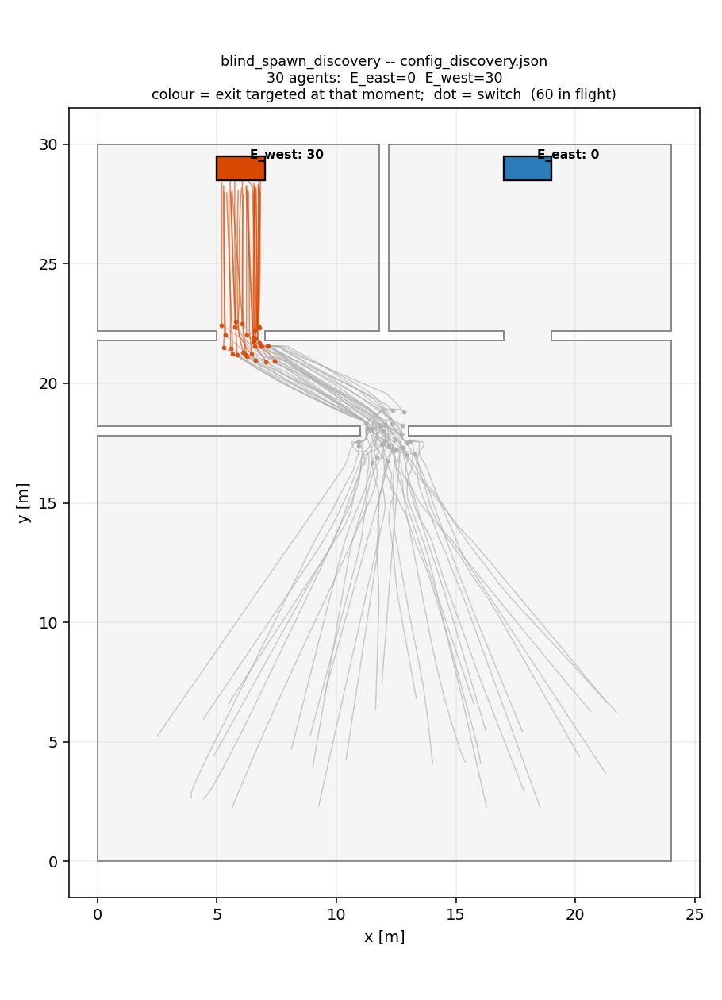

# Blind spawn: discovery through occlusion

**What does an agent do when it knows no way out at all?**

Every other discovery asset here is one convex room whose builder *asserts* that
an exit is legible from the spawn area, so an agent always has a default target.
This one removes that guarantee. Both exits are behind walls, so a `discovery`
agent spawns with no exit in its cognitive map, `rank_routes` returns nothing,
and the agent has to explore.

That state had never occurred in a simulation before this asset. Finding out
what happens in it is the point — and what happened first was that nothing did.
See "What this asset found" below.

## Layout

```
 y=30  +---------------+---------------+
       |   west room   |   east room   |
       |   [E_west]    |   [E_east]    |
 y=22  +-----[C2]------+------[C3]-----+     doorways, 2 m wide
       |          corridor             |
 y=18  +------------[C1]---------------+     doorway, 2 m wide
       |                               |
       |     spawn hall, 30 agents     |
 y=0   +-------------------------------+
      x=0                            x=24
```

## Hidden by geometry, not by distance or bearing

Both exits sit **24.7 m** from the spawn centroid, inside the 30 m visibility
ceiling, and both signs are **omni-directional** (`alpha` omitted, which
fdsvismap reads as readable from any bearing). Distance and bearing are
therefore ruled out, and only one term of the legibility rule is left to hide
them:

```
view_angle · visibility · non_concealed  ≥  distance
```

| term | value here | why |
|---|---|---|
| `view_angle` | 1 | every sign is omni-directional |
| `visibility` | 30 m | clear air, so `min(c/K̄, max_vis) = max_vis` |
| `non_concealed` | **0** | the wall |
| `distance` | 24.7 m | inside the ceiling |

`non_concealed` is fdsvismap's line-of-sight mask, and until this asset it had
no test at any level. `build_geometry.py` refuses to write the asset unless the
exits are *both* inside the ceiling and occluded, because an asset that hid them
by distance instead would look identical from the outside and would test nothing
new. `test_removing_the_walls_would_make_the_exits_legible` closes the loop from
the other side.

## The expected sequence, and why it is three hops

| hop | map | routing | why |
|---|---|---|---|
| 0 | `{spawn, C1}` | ranking **empty** → explore to `C1` | exits occluded; `C1` visible |
| 1 | `+ C2, C3` | still empty → explore to `C2` | `expand_on_arrival` reveals neighbours; exits are not neighbours of `C1` |
| 2 | `+ E_west` | commits to `E_west` | the exit behind the doorway it chose |

Hop 1 stays exit-free only because **betweenness pruning** keeps the exits
non-adjacent to `C1`:

```
jps-distributions_0 -> C1
C1                  -> C2, C3
C2                  -> E_west, C1, C3
C3                  -> E_east, C1, C2
```

`expand_on_arrival` ignores visibility entirely and reveals *every* neighbour,
so pruning is the only thing standing between this scenario and a single hop.
`test_but_still_no_exit` asserts it directly, rather than letting the scenario
silently collapse if pruning regresses.

## Configs

One geometry, four configs, each changing exactly one thing.

| config | familiarity | entrance | egress | what it isolates |
|---|---|---|---|---|
| `config_discovery.json` | `discovery` | — | 43.3 s | the sequence above |
| `config_full.json` | `full` | — | 36.4 s | lower bound: straight out, 0 switches |
| `config_entrance.json` | `discovery` | `E_west` | 47.5 s | seeding: knows one door at t=0 |
| `config_mixed.json` | `0.5` | — | 39.2 s | scalar familiarity in a run |

All four evacuate 30/30.

`config_entrance.json` is the Station crush mechanism in miniature — everyone
entered by one door, so everyone knows that door. It was wired through the code
with no behavioural test anywhere until this asset.

## Running it

```bash
mkdir -p /tmp/bsd && cd /tmp/bsd \
  && fds /path/to/assets/blind_spawn_discovery/blind_spawn_discovery.fds && cd -

.venv/bin/python run.py \
    --scenario assets/blind_spawn_discovery/config_discovery.json \
    --fds-dir /tmp/bsd \
    --vis-cache /tmp/vis_bsd.npz \
    --output-sqlite /tmp/bsd.sqlite \
    --output-route-history /tmp/bsd_routes.csv

.venv/bin/python scripts/plot_trajectories.py /tmp/bsd.sqlite \
    --config assets/blind_spawn_discovery/config_discovery.json \
    --route-history /tmp/bsd_routes.csv \
    -o assets/blind_spawn_discovery/trajectories_discovery.png \
    --title "blind_spawn_discovery -- config_discovery.json"
```

`--vis-cache` is what constructs the visibility model; without it every
neighbour enters the map unconditionally and a `discovery` agent behaves like a
`full` one. Each config needs its own cache file — the sign descriptors are part
of the cache metadata.



**Grey means exploring.** The plotter colours a path by the exit targeted at
that moment, and while an agent is heading for a doorway it has no exit target
at all. So grey is the state this asset exists to produce, and the two dots on
each path are the two frontier hops.

## What this asset found

Two engine defects, both of which made frontier exploration impossible in any
simulation while every unit test passed. The unit tests call
`evaluate_and_reroute` directly; only a simulation runs the direct-steering loop
that produces the state.

**1. A frontier hop retired the agent.** `advance_path_target` set
`state="done"` whenever a stage had nothing scripted after it. `done` means
"finished" — the reroute pass skips those agents — but for an explorer it meant
"arrived at the frontier", which is precisely when it must re-plan. First run:
**0 of 30 evacuated.** Arrival now records the stage as the routing origin and
leaves the agent `idle`, which is re-evaluated.

**2. The same-exit branch froze half the crowd.** Agents are assigned a nearest
exit by straight-line distance before routing runs, and that seeds
`route_state.current_exit`. When an explorer discovered exactly that exit,
`old_exit == best.exit_id` sent it down the same-exit branch, which compares
against a committed path an idle agent does not have — so it was never routed
anywhere. Second run: **10 of 30**, and every one of those ten had been assigned
`E_east` and discovered `E_west`. The other twenty were assigned `E_west`,
discovered `E_west`, and stood at the doorway for 300 s.

Both are pinned by `TestAnIdleAgentIsNotRetired` in `tests/test_route_graph.py`,
verified to fail without the fixes.

## Known limitation: the frontier choice is position-blind

All 30 agents go through `C2`. The east room is never entered.

`nearest_frontier_target` measures with `shortest_path_to(source, node)` — from
the graph *node*, never from the agent — and `C2` and `C3` are equidistant from
`C1`, so `sorted(frontier)` breaks the tie the same way for everyone. A crowd
therefore never fans out in symmetric geometry, however it is spread across the
hall.

This is recorded rather than fixed: giving the frontier choice the agent's
position is a modelling change, not a test fix.
`TestTheFrontierTieBreakIsPositionBlind` documents it so it is not rediscovered.

## Deliberate choices

**Clear air.** The extinction field is zero, so `visibility = max_vis`
everywhere and legibility depends on geometry alone.

**Symmetric exits.** Removes distance as an explanation for where agents go.

**Checkpoint boxes 2 m deep, not 0.4 m.** Direct steering walks each agent to a
random point inside the stage polygon and counts arrival within 0.7 m of *that
point*. A box only as deep as the wall gives thirty agents the same sliver to
aim at. The builder asserts a minimum depth. (Related: `inside_since` and
`reach_penetration` are written into `wait_info` and never read — arrival is
proximity to a point, not containment in the polygon.)

**No journeys or transitions.** The graph auto-wires and cost decides, which is
what puts betweenness pruning on the critical path.

## Regenerating

```bash
.venv/bin/python assets/blind_spawn_discovery/build_geometry.py
```

Writes `geometry.wkt`, `blind_spawn_discovery.fds` and all four configs, and
refuses if any premise has broken — exits outside the ceiling, exits visible,
`C1` invisible, asymmetric exits, or checkpoint boxes too shallow.

## Tests

`tests/test_blind_spawn_discovery.py`, 23 tests, no FDS output needed:
`OccludingVisMap` reimplements the line-of-sight term on the walkable polygon,
the same way `test_cognitive_map_memory.py` reimplements the view-angle term.
