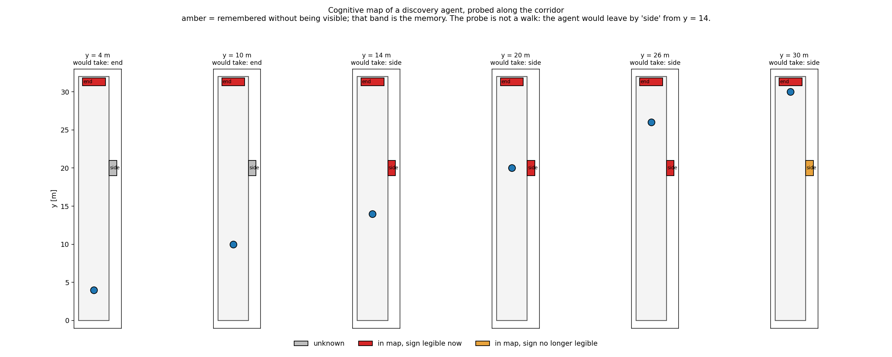
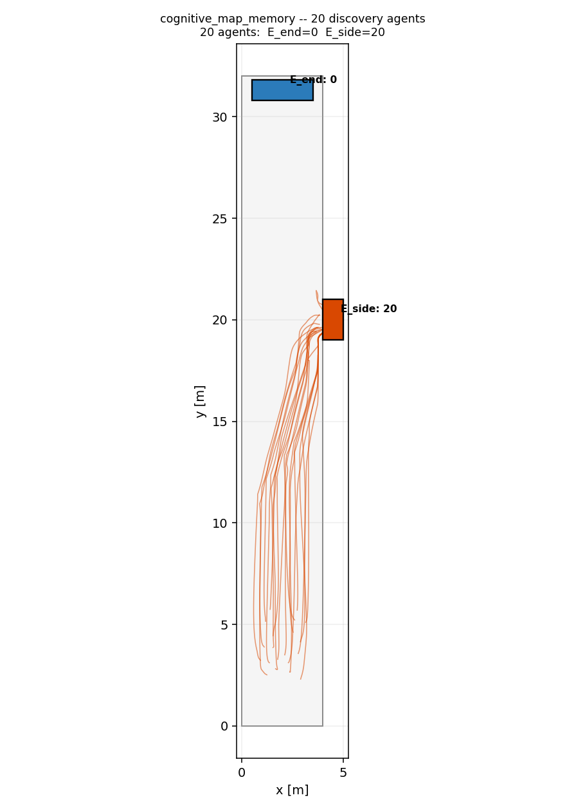

# Cognitive map: acquisition and persistence

**Does an agent remember an exit after it can no longer see the sign?**

A cognitive map differs from a visibility query in exactly one respect: it
remembers. This scenario separates the two.

## Layout

A 4 m wide corridor running north, with an alcove exit in the east wall.

```
 y = 32  +--------+   E_end   legible from the whole corridor
         |        |
 y = 27.5|········|  <- upper edge of the legibility window
         |        |
 y = 20  |      [E_side]      sign faces west
         |        |
 y = 12.5|········|  <- lower edge of the window
         |        |
 y =  4  |  spawn |   20 discovery agents; only E_end is known
 y =  0  +--------+
```

## The legibility window is derived, not tuned

fdsvismap decides legibility as `view_angle * visibility >= distance`. For a
sign facing west at `(4, 20)`, an agent on the centreline `x=2` has
`view_angle = 2/d`, so the test becomes `2/d * 30 >= d`, i.e. `d <= sqrt(60)`.
With `d² = 4 + (y−20)²` that gives

```
legible while |y − 20| <= 7.48   →   y ∈ [12.5, 27.5]
```

Off-axis geometry kills the view angle faster than proximity helps, which is
what produces a band rather than a half-plane. `build_geometry.py` recomputes
this window and asserts it, so changing the corridor width or the sign position
cannot silently move it.

## The two claims

| claim | what it asserts | why it matters |
|---|---|---|
| **acquisition** | `E_side` enters the map on crossing `y = 12.5`, and the agent would then take it | perception writes to memory, and it changes behaviour |
| **persistence** | it is *still* in the map at `y = 30` | memory outlives perception |

Persistence is the one that matters. Delete the expansion rules and acquisition
still appears to work for any agent that happens to start inside the band; only
persistence catches it.

A third test closes the loop to routing: a remembered-but-illegible exit must
still be *routable*. Before the visibility consolidation it was not — the router
vetoed any route whose first hop had an unreadable sign, so an agent could know
an exit and be forbidden to use it.

## Visualising it

```bash
.venv/bin/python scripts/generate_cognitive_map_states.py
```



Each panel names the exit routing would actually take from that spot. The
agent's position is a **probe**, not a simulated walk: it is placed at each y to
sample what it would know and choose there. It switches to `side` at y = 14, the
moment that exit enters the map, and would leave by it — an earlier version of
this plot marched the probe past the side exit, implying a behaviour the model
does not have.

## What the simulation actually does

The panels above are drawn from `rank_routes` with a probe. This is the
trajectory database of a real run:

```bash
mkdir -p /tmp/cmm && cd /tmp/cmm \
  && fds /path/to/assets/cognitive_map_memory/cognitive_map_memory.fds && cd -

.venv/bin/python run.py \
    --scenario assets/cognitive_map_memory/config.json \
    --fds-dir /tmp/cmm \
    --vis-cache /tmp/vis_cmm.npz \
    --output-sqlite /tmp/cmm.sqlite \
    --output-route-history /tmp/cmm_routes.csv

.venv/bin/python scripts/plot_trajectories.py /tmp/cmm.sqlite \
    --config assets/cognitive_map_memory/config.json \
    -o assets/cognitive_map_memory/trajectories.png \
    --title "cognitive_map_memory -- 20 discovery agents"
```



**20 of 20 agents divert into `E_side`**, egress 21.9 s. Two switches each:
`E_side → E_end` at t = 0 (the assigned nearest exit is not yet in the map, so
routing falls back to the only exit that is), then `E_end → E_side` between
t = 5 and t = 19 as each agent crosses `y = 12.5` and the sign becomes legible.
Agent 1 switches at t = 8 s, y = 11.7.

**What this does not show is persistence.** An agent that turns off at y ≈ 13
never reaches y = 30, so no trajectory exercises "still remembers `E_side`
after the sign goes illegible". That claim rests on
`test_side_exit_persists_after_its_sign_goes_illegible` and
`test_a_remembered_exit_is_routable_though_illegible`, and on nothing in this
picture. Demonstrating it in a run would need a reason to keep walking north
past the window — smoke on the side route, or an explicit journey.

Until 2026-08-06 this run sent all 20 agents to `E_end` instead. The cognitive
map was working — `E_side` entered it at t = 8 s exactly as designed — but the
route cost charged any exit other than the one the agent was already heading
for as if the agent first had to walk back to its spawn area, so `E_side` was
priced at 30.5 m when it was 3.5 m away. See the superseded-rule note in
[`docs/rerouting-oscillation-notes.md`](../../docs/rerouting-oscillation-notes.md).

Three states per exit:

- **grey** — unknown, never perceived
- **red** — in the map, sign readable right now
- **amber** — in the map, sign no longer readable

The amber band is the memory. If red and amber never diverge, there is nothing
a plain visibility query could not have told you.

## Deliberate choices

**Clear air.** The deck carries no fire, so the extinction field is zero and
legibility depends on position alone. Any change in what the agent knows is
attributable to where it stands.

**Corridor length 32 m, not longer.** `E_end` must be legible from the spawn
area so the agent has a default target; beyond the 30 m visibility ceiling it
would start knowing *no* exit and fall back to frontier exploration, which is a
different scenario. The builder asserts this — it is the failure that a longer
corridor produces silently. See the ceiling discussion in
[`exit_visibility_alpha`](../exit_visibility_alpha/README.md).

**No journeys or transitions.** The graph auto-wires and cost decides.

**Familiarity `discovery`.** At `full` the map holds everything from t=0 and
there is nothing to acquire; a test pins that contrast.

## Note on "loss"

The map is **monotone** — `expand_from_visibility` and `expand_on_arrival` only
ever add. Knowledge is never lost; only *visibility* is, which is the red→amber
transition. Genuine forgetting (decay of knowledge over time or under stress) is
not modelled, and adding it would re-introduce the oscillation the exit-switch
anchor exists to suppress.
