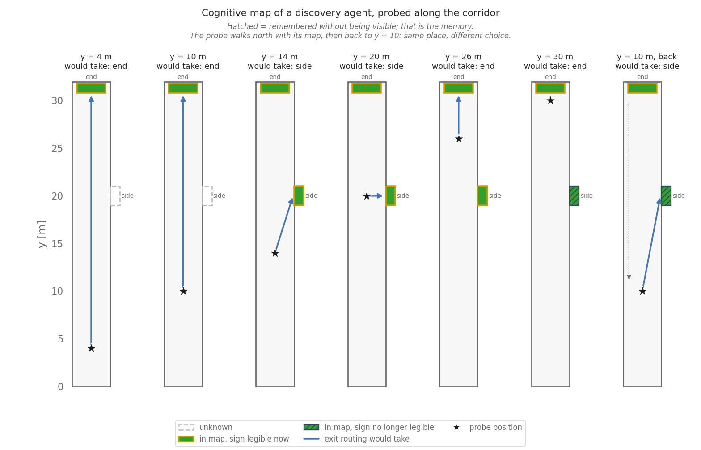
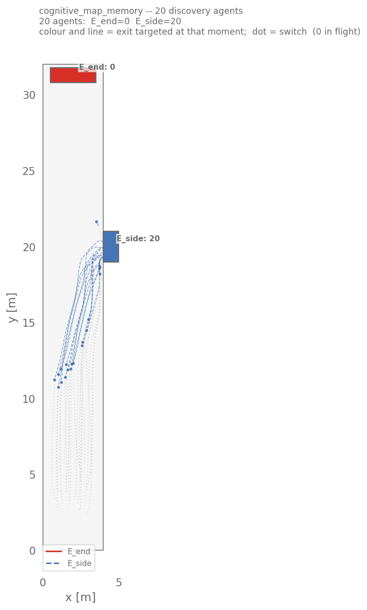

# Cognitive map: acquisition and persistence

**Does an agent remember an exit after it can no longer see the sign?**

A cognitive map differs from a visibility query in exactly one respect: it
remembers. This scenario separates the two.

## Layout

A 4 m wide corridor running north, with an alcove exit in the east wall.

```
 y = 32  +--------+   E_end   legible from the whole corridor
         |        |
 y = 27.5|········|  <- upper edge of the legibility window
         |        |
 y = 20  |      [E_side]      sign faces west
         |        |
 y = 12.5|········|  <- lower edge of the window
         |        |
 y =  4  |  spawn |   20 discovery agents; only E_end is known
 y =  0  +--------+
```

## The legibility window is derived, not tuned

fdsvismap decides legibility as `view_angle * visibility >= distance`. For a
sign facing west at `(4, 20)`, an agent on the centreline `x=2` has
`view_angle = 2/d`, so the test becomes `2/d * 30 >= d`, i.e. `d <= sqrt(60)`.
With `d² = 4 + (y−20)²` that gives

```
legible while |y − 20| <= 7.48   →   y ∈ [12.5, 27.5]
```

This uses the 30 m cap, fdsvismap's default and pyFDS-Evac's. On the
0.25 m grid the model reads the sign from y = 12.3 to 27.8 on the centreline
(`scripts/figures/map_memory.py` computes and draws it); the difference comes
from the rasterised sight line.

Off-axis geometry kills the view angle faster than proximity helps, which is
what produces a band rather than a half-plane. `build_geometry.py` recomputes
this window and asserts it, so changing the corridor width or the sign position
cannot silently move it.

## The two claims

| claim | what it asserts | why it matters |
|---|---|---|
| **acquisition** | `E_side` enters the map on crossing `y = 12`, and the agent would then take it | perception writes to memory, and it changes behaviour |
| **persistence** | it is *still* in the map at `y = 30` | memory outlives perception |

Persistence is the one that matters. Delete the expansion rules and acquisition
still appears to work for any agent that happens to start inside the band; only
persistence catches it.

A third test closes the loop to routing: a remembered-but-illegible exit must
still be *routable*. Before the visibility consolidation it was not — the router
vetoed any route whose first hop had an unreadable sign, so an agent could know
an exit and be forbidden to use it.

## Visualising it

```bash
.venv/bin/python scripts/generate_cognitive_map_states.py
```



Each panel names the exit routing would actually take from that spot. The
agent's position is a **probe**, not a simulated walk: it steps north along the
centreline, learning what it sees at each y, then steps back to y = 10 with
the map it has built. `scripts/figures/_cognitive_map_probe.py` does the
sweep, and `test_map_memory_probes_match_engine` pins its outcomes.

- **y = 4 and 10:** only `E_end` is known, so the agent takes `end`.
- **y = 14 to 24:** `E_side` is in the map and nearer, so the agent takes
  `side`, from the moment it enters the map.
- **y = 26 and above:** `end`. Routes are priced from the agent's position,
  and the two exits are equally far at y ≈ 25.4; at y = 30 `E_end` is 1.3 m
  away against 10.3 m. `E_side` is still in the map and still routable, but
  no longer the nearer one.
- **Back at y = 10:** `side` (10.3 m against 21.3 m for `end`). On the way up
  the same spot gave `end`. Same place, different history, different choice:
  that is the memory changing behaviour.

## What the simulation actually does

The panels above are drawn from `rank_routes` with a probe. This is the
trajectory database of a real run:

```bash
mkdir -p /tmp/cmm && cd /tmp/cmm \
  && fds /path/to/assets/cognitive_map_memory/cognitive_map_memory.fds && cd -

uv run python run.py \
    --scenario assets/cognitive_map_memory/config.json \
    --fds-dir /tmp/cmm --allow-fds-horizon-hold \
    --vis-cache /tmp/vis_cmm.npz \
    --output-sqlite /tmp/cmm.sqlite \
    --output-route-history /tmp/cmm_routes.csv

uv run python scripts/plot_trajectories.py /tmp/cmm.sqlite \
    --config assets/cognitive_map_memory/config.json \
    --route-history /tmp/cmm_routes.csv \
    -o assets/cognitive_map_memory/trajectories.png \
    --title "cognitive_map_memory -- 20 discovery agents"
```



**`--route-history` is what makes this readable.** Without it the paths are
coloured by the exit each agent *reached*, so every line is `E_side` orange from
the spawn area onward and the scenario looks like agents that aimed at the side
door from the start. With it, each path is coloured by the exit the agent was
aiming at *at that moment*, and a dot marks the change of mind.

**20 of 20 agents divert into `E_side`**, egress 21.5 s (`Simulation
finished in 21.47 s (20/20 evacuated).`). One switch each: `E_end → E_side`
between t = 5 and t = 19 s, as each agent enters the legibility region and
the sign becomes readable. Agent 1 switches at t = 11 s, at x = 3.7,
y = 18.9. Measured at `289b33d0` against the deck's FDS output, with
`--allow-fds-horizon-hold` because the FDS run ends before the 300 s run
time; the run files are in the project's data store under
`cognitive_map_memory/rerun_289b33d0/`.

The switch dots are spread over y ∈ [10.5, 18.9], 13 of 20 below 15,
rather than lying on a line at y = 12.5. The window is derived for the
centreline x = 2. The sign hangs on the east wall, so an agent near that
wall (x ≈ 3.7) sees it at a grazing angle and has to get closer, to
y ≈ 17–19, before it becomes legible. An agent near the west wall
(x < 1.5) sees it closer to face-on and switches from y ≈ 10.5. Route
switches fall on whole seconds, so a switch can trail the moment the sign
becomes legible by up to about a metre of walking.

**What this does not show is persistence.** An agent that turns off at y ≈ 13
never reaches y = 30, so no trajectory exercises "still remembers `E_side`
after the sign goes illegible". That claim rests on
`test_side_exit_persists_after_its_sign_goes_illegible` and
`test_a_remembered_exit_is_routable_though_illegible`, and on nothing in this
picture. Demonstrating it in a run would need a reason to keep walking north
past the window — smoke on the side route, or an explicit journey.

Until 2026-08-06 this run sent all 20 agents to `E_end` instead. The cognitive
map was working — `E_side` entered it at t = 8 s exactly as designed — but the
route cost charged any exit other than the one the agent was already heading
for as if the agent first had to walk back to its spawn area, so `E_side` was
priced at 30.5 m when it was 3.5 m away. See the superseded-rule note in
[`docs/rerouting-oscillation-notes.md`](../../docs/rerouting-oscillation-notes.md).

Three states per exit in the probe figure:

- **hollow, dashed grey outline** — unknown, never perceived
- **green, gold outline** — in the map, sign readable right now
- **green, hatched** — in the map, sign no longer readable

The hatched state is the memory. If legible and hatched never diverge, there
is nothing a plain visibility query could not have told you.

## Deliberate choices

**Clear air.** The deck carries no fire, so the extinction field is zero and
legibility depends on position alone. Any change in what the agent knows is
attributable to where it stands.

**Corridor length 32 m, not longer.** `E_end` must be legible from the spawn
area so the agent has a default target; beyond the 30 m visibility ceiling it
would start knowing *no* exit and fall back to frontier exploration, which is a
different scenario. The builder asserts this — it is the failure that a longer
corridor produces silently. See the ceiling discussion in
[`exit_visibility_alpha`](../exit_visibility_alpha/README.md).

**No journeys or transitions.** The graph auto-wires and cost decides.

**Familiarity `discovery`.** At `full` the map holds everything from t=0 and
there is nothing to acquire; a test pins that contrast.

## Note on "loss"

The map is **monotone** — `expand_from_visibility` and `expand_on_arrival` only
ever add. Knowledge is never lost; only *visibility* is, which is the legible→hatched
transition. Genuine forgetting (decay of knowledge over time or under stress) is
not modelled, and adding it would re-introduce the oscillation the exit-switch
anchor exists to suppress.
