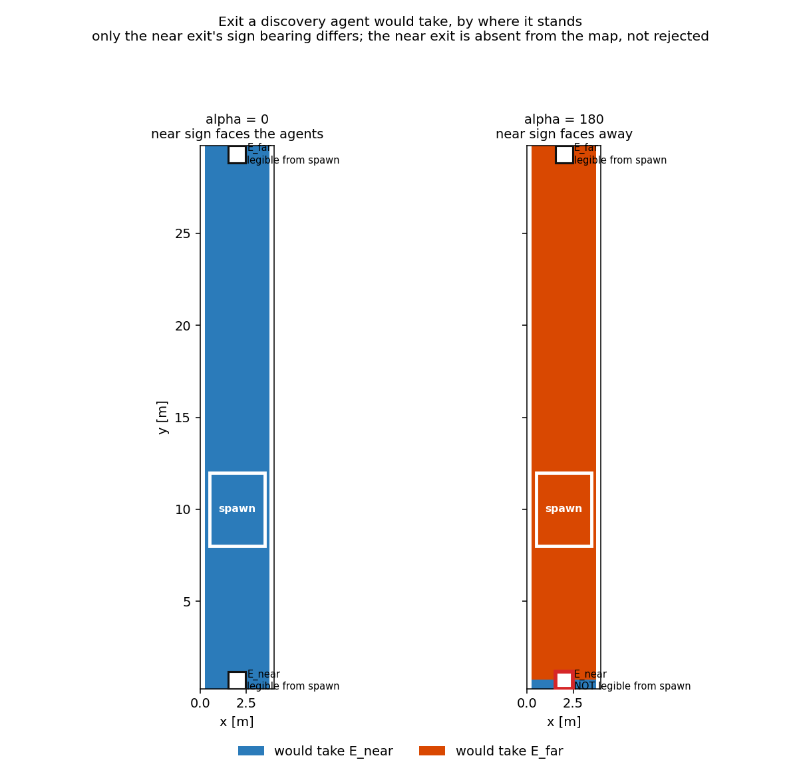
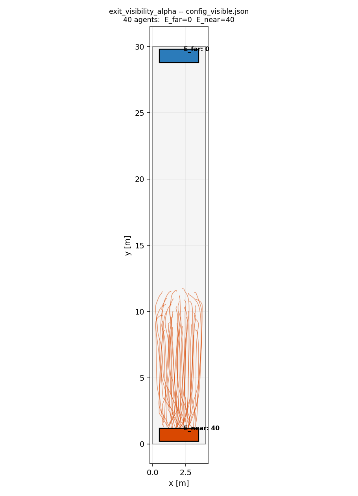
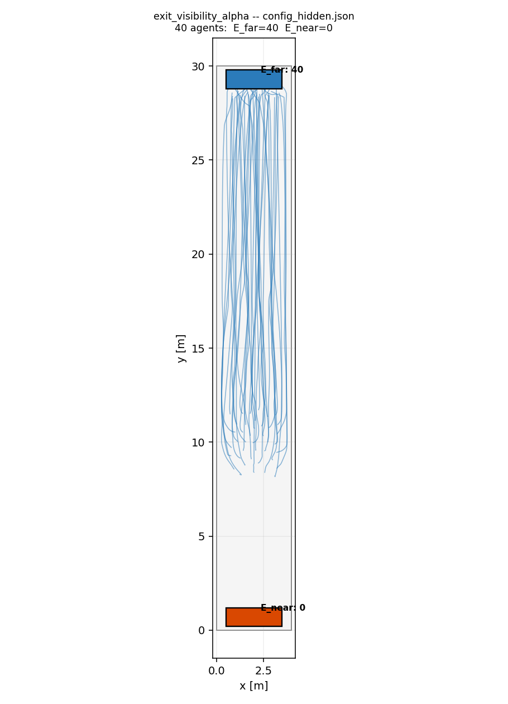

# Exit visibility vs. sign bearing

A single-variable experiment: **does an agent abandon its nearest exit when
that exit's sign faces away from it?**

The two configs in this directory are byte-identical apart from one number —
the viewing bearing (`alpha`) of the near exit's sign. Any difference in exit
choice is therefore attributable to sign orientation and nothing else.

## Layout

A straight north–south corridor, 4 m wide and 30 m long.

```
 y = 30  +--------+   E_far    alpha = 180, always legible
         |        |
 y = 12  |  spawn |   40 agents
 y =  8  |        |
 y =  0  +--------+   E_near   alpha is the experiment's variable
```

Agents stand roughly 9 m from `E_near` and 19 m from `E_far`, so distance
favours `E_near` by more than 2:1 in both runs. The corridor is 30 m rather
than longer for a reason — see the pitfall below.

## Pitfall: the visibility ceiling

**Read this before building any scenario that depends on sign legibility.**

fdsvismap decides that a sign is legible from a cell when

```
view_angle x visibility >= distance
```

with `view_angle` clipped to `[0, 1]` (`FDSVisMap._get_view_angle_array`) and

```
visibility = c / mean_extinction     capped at max_vis, default 30 m
                                     equal to max_vis when extinction is 0
```

(`FDSVisMap._get_visibility_array`, `FDSVisMap.get_vismap`).

Two consequences that are easy to miss:

**In clear air the reach is 30 m, full stop.** Extinction is zero, so
`visibility` is `max_vis`. Because `view_angle` cannot exceed 1, a sign more
than 30 m away is illegible **at every bearing**. No choice of `alpha` rescues
it.

**With smoke the reach is `c / K̄`, which is usually far shorter.** The cap
stops mattering almost immediately:

| `c` | mean extinction `K̄` | usable radius |
|---|---|---|
| 3 (reflective) | 0.0 (clear) | 30 m — the cap |
| 3 | 0.1 | 30 m — still capped |
| 3 | 0.2 | 15 m |
| 3 | 0.5 | 6 m |
| 8 (illuminated) | 0.5 | 16 m |

So a smoke scenario needs its exits inside the *smoke-reduced* radius, not
inside 30 m. Sizing a corridor against the clear-air ceiling and then adding
smoke will silently push every sign out of range.

### Why this bites quietly

An out-of-range sign does not raise. Its route is rejected as
`next_node_not_visible`, and if *every* route is rejected the fallback
reinstates the least-cost rejected one — so agents proceed to the nearest exit
exactly as if visibility were never modelled. The simulation runs, the numbers
look plausible, and the experiment measures nothing.

This scenario hit precisely that. An earlier draft used a 44 m corridor with
`E_far` 33 m from the spawn area:

```
OLD corridor (44 m), hidden config
  E_near  d= 9.3  view_angle=0.00    0.0 >=  9.3 ? False
  E_far   d=33.3  view_angle=1.00   30.0 >= 33.3 ? False   <- never legible
```

Both exits illegible, fallback to `E_near`, and the assertion "agents take the
near exit when its sign is visible" passed for the wrong reason. The corridor is
30 m so that `E_far` sits at 19.3 m, comfortably legible head-on, while distance
still favours `E_near` by more than 2:1.

### Guards

Two, because a silent failure needs catching from both ends:

- `build_geometry.py` refuses to write the asset if either sign is at or beyond
  `MAX_VIS_M` from the spawn centroid.
- `test_both_exits_are_inside_the_visibility_cap` asserts the same, and further
  asserts `view_angle * max_vis >= distance` for both — so a bearing that is
  merely *poor* rather than reversed is caught too.

The test double models the full rule rather than the half-plane alone. That
distinction is what makes the guard possible: a half-plane-only double reports
a 33 m sign as perfectly legible.

## The two runs

| config | `E_near` alpha | sign faces | expected outcome |
|---|---|---|---|
| `config_visible.json` | 0 | north, toward the agents | both exits enter the map; agents take the nearer, `E_near` |
| `config_hidden.json` | 180 | south, away from them | `E_near` never enters the map; agents walk the extra 10 m to `E_far` |

The near exit is **not rejected** in the hidden run — it is absent. Routing
consults the agent's cognitive map, and legibility decides what enters it, so
Dijkstra never sees an exit the agent has not perceived. Absence is a stronger
claim than rejection: a rejected route still appears in the ranking, flagged
and sorted last, and the all-rejected fallback can reinstate it.

`alpha` is a compass bearing in degrees clockwise from north. fdsvismap makes a
sign legible only within the half-plane it faces, with cosine falloff — head-on
gives a factor of 1, 90° to the side gives 0, and behind is clipped to 0.

The flip is the point. Distance still favours `E_near` in both runs, so a model
that ignored sign orientation would send agents there either way.

## Visualising it

```bash
.venv/bin/python scripts/generate_exit_visibility_map.py
```



Each cell is shaded by the exit a discovery agent standing there would take,
given what it can perceive from that spot. Exit markers are outlined in red
where the sign is illegible from the spawn area.

The shading flips **wholesale** rather than at a cost crossover, and that is the
signature of the mechanism: the near exit is not out-priced in the right-hand
panel, it is absent from the agent's map, so routing never sees it. A cost
effect would show a boundary somewhere in the corridor; membership shows none.

The stray near-exit cells at the very bottom of the right panel are correct
physics — below `y = 0.7` an agent is south of the sign, inside the half-plane
it faces, so it becomes legible again.

## What the simulation actually does

The map above is drawn from `rank_routes` — it shows what routing *would*
decide. It is not evidence about what agents *do*. To see that, run the
scenario and plot the trajectory database it writes:

```bash
FDS_DIR=/path/to/exit_visibility_alpha/fds/output   # see "Regenerating" below

for v in visible hidden; do
  .venv/bin/python run.py \
      --scenario assets/exit_visibility_alpha/config_$v.json \
      --fds-dir "$FDS_DIR" \
      --vis-cache /tmp/vis_$v.npz \
      --output-sqlite /tmp/run_$v.sqlite

  .venv/bin/python scripts/plot_trajectories.py /tmp/run_$v.sqlite \
      --config assets/exit_visibility_alpha/config_$v.json \
      -o assets/exit_visibility_alpha/trajectories_$v.png \
      --title "exit_visibility_alpha -- config_$v.json"
done
```

**`--vis-cache` is not optional here.** It is what constructs the visibility
model — without it `vis_model` is `None`, every adjacent node is added to the
cognitive map unconditionally, and both configs send every agent to `E_near`.
That is not a bug; it is the documented meaning of running without a visibility
model. But it makes this scenario measure nothing, so the flag belongs in the
command, not in a footnote.

**The two runs need two cache files.** `--vis-cache` names a destination, not
an input: a missing file is computed from the FDS slices and written, and an
existing one is reused only when its stored metadata — `fds_dir`, the sign
descriptors, the time step, the slice height — still matches. The sign
descriptors are exactly what differs between these configs, so a shared path
would recompute on every alternation. Correct results, no caching, and a
puzzling wait. Hence `vis_$v.npz` rather than one file.

`scripts/plot_trajectories.py` reads `trajectory_data` from the SQLite and
attributes each agent to the exit polygon nearest its final position, provided
it finished within `--reach` metres (default 1.5 m). Agents that ended anywhere
else are drawn grey and counted separately, so a run where most agents never
got out cannot pass for a clean result.

### The result

| | `E_near` | `E_far` | egress |
|---|---|---|---|
| `config_visible.json` (alpha = 0) | 40 | 0 | 18.20 s |
| `config_hidden.json` (alpha = 180) | 0 | 40 | 26.02 s |




Turning the near sign away costs 7.8 s and sends every agent past it, the
extra 10 m to `E_far`. All 40 switch at t = 0, on their first evaluation: the
near exit never enters their map, so there is nothing to reconsider later.

This is what the asset was built to show, and until
[#61](https://github.com/PedestrianDynamics/pyFDS-Evac/issues/61) was fixed it did
not. Both configs produced the same 18.20 s run, because agents were rooted at
their assigned exit rather than their spawn area and the distribution's
`familiarity` never reached them. The unit tests in
`tests/test_exit_visibility_alpha.py` passed throughout — they call
`rank_routes` directly, so they tested the routing decision, which was correct,
and not the path from the simulation to that decision, which was not.

That is the argument for plotting from the trajectory database. A plot drawn
from the router would have shown this flip a month before the simulation could
produce it.

## Deliberate choices

**Agents are `discovery` tier**, which is the only tier where sign legibility
means anything. A `full` agent knows every exit from t=0 and walks to `E_near`
under either bearing — correctly, since it does not need to read a sign to
find a door it already knows. Signs are wayfinding information; they bind only
where knowledge is incomplete. `test_a_fully_familiar_agent_ignores_the_bearing`
pins that.

**The air is clear.** `exit_visibility_alpha.fds` carries no fire, so the
extinction field is zero everywhere and legibility is decided by viewing angle
and distance alone. That is what keeps `alpha` the single independent variable —
with smoke present, an outcome could always be attributed to extinction
instead.

**No journeys or transitions.** The stage graph auto-wires every spawn area to
every exit and the composite cost decides, which is the routing mode this
experiment is about.

## Regenerating

```bash
.venv/bin/python assets/exit_visibility_alpha/build_geometry.py
```

This writes `geometry.wkt`, both configs, and `exit_visibility_alpha.fds`. The
FDS deck is generated from the WKT via `pyfds_evac.core.wkt_to_fds`, with the
generator's burner stripped and its analysis slices kept — fdsvismap needs an
`EXTINCTION COEFFICIENT` slice to answer any legibility query at all, so
`--geometry-only` would not do, since it drops the slices along with the fire.
The builder asserts both conditions and fails loudly if either is violated.

The deck must then be run once to produce the slice files that `--fds-dir`
points at:

```bash
mkdir -p /tmp/eva && cd /tmp/eva
fds /path/to/assets/exit_visibility_alpha/exit_visibility_alpha.fds
```

The air is clear, so this is quick and its output is reusable across both
configs — they differ only in a sign bearing, which lives in the JSON, not in
the deck.

## Tests

`tests/test_exit_visibility_alpha.py` drives this asset through the real
routing code. It needs no FDS output: it reimplements fdsvismap's clear-air
rule — `view_angle * max_vis >= distance` — so the test exercises our routing
decision rather than the third-party visibility solver. Modelling the distance
comparison and not merely the half-plane is what makes the cap guard possible.

Alongside the two headline assertions it carries four guards, because the
experiment is worthless if its premises silently drift:

- the configs differ in nothing but the bearing;
- `E_near` really is the closer exit, so distance never explains the flip;
- both signs sit inside the 30 m visibility cap, so neither is illegible for
  the trivial reason of being too far away;
- with no visibility model, **both** configs choose `E_near` — so the flip is
  caused by legibility, not by some accident of the geometry.

Running the scenario as a full simulation additionally requires FDS output for
the deck; the tests do not.
