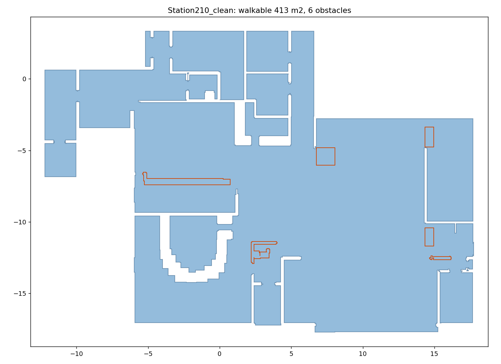

# The Station nightclub — walkable area

The 2003 Station fire, for validation against the witness statements in
Fahy, Proulx & Flynn (2011) rather than against another model. See
[the validation spec](../../docs/superpowers/specs/2026-08-05-station-validation-design.md).

`geometry.wkt` is **derived from `Station210_clean.fds`**, the NIST model, not
reconstructed by hand:

```bash
.venv/bin/python scripts/generate_walkable_from_fds.py \
    assets/station/Station210_clean.fds \
    -o assets/station/geometry.wkt --plot assets/station/walkable.png --report
```



| | |
|---|---|
| walkable | **412.8 m²**, 6 obstacles |
| extent | 30.0 m (x) × 21.1 m (y), L-shaped |
| vertices | 705, on the deck's 0.1 m grid |
| `jps.RoutingEngine` | accepts it |

## Checked against the dimensioned plan

| NCSTAR plan | extracted | |
|---|---|---|
| front elevation 24.2 m | 23.7 m | inside face of the walls, so ~0.5 m narrower — as expected |
| depth 20.9 m | 21.1 m | |

The 24.2 m dimension spans the **front elevation only**; the west wing extends
further left, which is why the overall extent is 30 m.

Every named space routes to the front door — the check that matters for an
evacuation geometry, and a stronger one than polygon validity:

```
west wing (dart room)   13 waypoints      dance floor    7 waypoints
raised platform         15                sunroom       10
rear corridor           10                main bar       6
```

## The four exits are named in the deck

Useful when placing exit stages by hand — this is transcription, not guesswork:

| deck name | position | plan label |
|---|---|---|
| `FRONT DOOR` | x 2.44–4.34, y ≈ −17.3 | Front Entrance Doors |
| `SIDE DOOR` | x ≈ −6.0, y −8.6…−7.6 | Kitchen Exit Door |
| `SIDE DOOR` | x ≈ −6.0, y −13.5…−12.5 | Main Bar Side Exit Door |
| `back door qqq` / `www` | x ≈ 17.7, y −11.4 / −12.4 | Platform Exit Door |

Windows are **not** exits here, though 27.9 % of survivors left by one. That
limitation is discussed in the validation spec, not worked around.

## Three decisions the extraction rests on

**Interior doors open, exterior doors stay shut.** Both had to be told apart and
neither name nor CAD layer does it: the deck carries `A-DOOR-STND-1` beside
free-text `door 5i`, `FRONT DOOR`, `back door qqq`. The rule is positional —
seal every door, find the outdoors as the region touching the mesh edge, and a
door fronting onto it is exterior. Of 74 door obstructions in the height band,
**8 stay shut and 66 open**.

Getting this wrong is not subtle. A prefix-only rule left `door 5i` sealing the
entire west wing (374.7 → 311.4 m²); opening *every* door instead let the
walkable area leak out of the building and collapse to 20.3 m².

**The platform handrail is treated as passable.** This is a modelling decision,
not an observation. `A-HRAL-RAIL`/`NWEL` at 0.15–1.06 m is a real barrier, and
leaving it solid cuts the raised platform off entirely — 37 m² that nobody can
enter or leave. But a 2-D walkable area cannot represent the stair opening in a
railing, nor the level change the railing guards. Occupants demonstrably stood
on the back wall platform and got off it, so an unreachable platform is the
worse error.

*Consequence, stated so it is not discovered later:* agents may cross the
platform edge anywhere, not only at the stairs (x 16.45–17.77, y −11.13…−10.11).

**Everything not horizontal blocks.** Walls, bars, counters, fixtures and
woodwork are obstacles; floors, ceilings, carpet, stair treads and risers are
not. `--report` prints the per-layer footprint and verdict so the classification
can be audited rather than trusted.

## What is not settled

The area is **412.8 m²**. Do not read the coincidence with the "412 m² footprint"
figure quoted in the validation spec as confirmation: a *walkable* area must be
smaller than a *gross* footprint once walls and casework are removed, so the two
cannot both be right about the same thing. Either that figure covers something
else, or it needs rechecking against NCSTAR directly. It has not been.

## Related

- `scripts/generate_walkable_from_fds.py` — the extractor, and the two FDS
  format traps it documents (`XB` is `x0,x1,y0,y1,z0,z1`; zero-thickness
  obstructions need their degenerate axis widened).
- `build_geometry.py` in this directory is an earlier **hand reconstruction**
  from the dimensioned plan, superseded by the extraction and kept only for
  reference.
