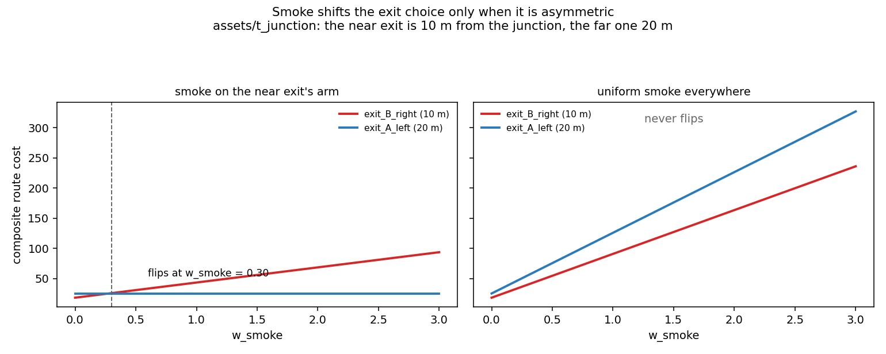

# T-junction test: smoke-blocked T-corridor

This scenario demonstrates all three pyFDS-Evac model features:
speed reduction, FED incapacitation, and dynamic rerouting.

## Geometry

A T-shaped corridor where agents spawn in a dead-end branch and must
walk through the fire zone to reach either exit.

```
  Exit A ←─── 20 m ───┬─── 10 m ───→ Exit B
  (left)               │ fire          (right)
                       │ at junction
                  ┌────┴────┐
                  │  agents  │  6 m wide
                  │  spawn   │  10 m deep
                  └─────────┘
```

- Horizontal corridor: 30 m x 3 m (y = 10 to 13)
- Vertical branch: 6 m x 10 m (x = 17 to 23, y = 0 to 10)
- Exit A at x = 0 (20 m from junction)
- Exit B at x = 30 (10 m from junction)
- 50 agents spawn in the branch at t = 0

## Fire setup (t_junction.fds)

A 1 MW PVC-cable fire at the junction produces heavy soot and toxic
gases. The fire ramps up over 60 seconds.


| Property | Value |
|----------|-------|
| Fuel | PVC cable (C2H3Cl) |
| Peak HRR | 1 MW (500 kW/m^2 x 2 m^2) |
| Soot yield | 0.172 |
| CO yield | 0.063 |
| HCN yield | 0.006 |
| HCl yield | 0.48 |
| Ramp-up | 0 to 100% over 60 s |
| Ceiling height | 3 m |
| Grid | 0.25 m (120 x 52 x 12 cells) |

## FDS slice outputs

Horizontal slices at z = 2 m (head height):

| Slice quantity | Used by |
|----------------|---------|
| Extinction coefficient | Smoke-speed model |
| Carbon monoxide volume fraction | FED (CO narcosis) |
| Carbon dioxide volume fraction | FED (hyperventilation factor) |
| Oxygen volume fraction | FED (hypoxia) |
| Hydrogen cyanide volume fraction | FED (CN narcosis) |
| Hydrogen chloride volume fraction | FED (irritant) |
| Visibility | fds-viewer visualization only |

## Why all three features are exercised

**Speed reduction.** Agents approaching the junction encounter
increasing extinction, reducing their walking speed via the
Frantzich-Nilsson correlation.

**FED incapacitation.** The 6 m branch narrows to a 3 m corridor,
creating a bottleneck at the junction. Agents queuing in heavy smoke
accumulate CO, HCN, and HCl exposure. The high HCl yield from PVC
drives the irritant term, while CO and O2 depletion contribute to
narcosis. Some agents reach FED = 1.0 and become incapacitated.

**Rerouting.** Exit B is initially closer (10 m vs 20 m), so agents
prefer it. As smoke builds and drifts right, the route cost to Exit B
increases and agents switch to Exit A.

## Running

1. Run the FDS simulation:

```bash
fds assets/t_junction/t_junction.fds
```

2. Run the evacuation:

```bash
uv run python run.py \
  --scenario assets/t_junction \
  --fds-dir assets/t_junction \
  --enable-rerouting \
  --reroute-interval 5 \
  --output-smoke-history smoke.csv \
  --output-fed-history fed.csv \
  --output-route-history routes.csv
```

## Smoke-weight sweep: when does smoke actually change the exit?

`tests/test_rerouting_smoke_sweep.py` drives this asset's geometry through the
composite cost at a range of `w_smoke`, without needing FDS output.

The T puts exit B 10 m from the junction and exit A 20 m, so **distance alone
always prefers B**. With heavy extinction on B's arm:

| `w_smoke` | best exit | cost A | cost B |
|---|---|---|---|
| 0.0 | `exit_B_right` | 25.16 | 18.16 |
| 0.5 | `exit_A_left` | 25.16 | 30.73 |
| 1.0 | `exit_A_left` | 25.16 | 43.30 |
| 5.0 | `exit_A_left` | 25.16 | 143.87 |

The crossover is at **`w_smoke` ≈ 0.28**. Note that cost A never moves: smoke
charges only the route that passes through it.

### The control that matters

Under **uniform** smoke the choice never flips, at any weight. Uniform
extinction scales both routes by the same factor, so the shorter one stays
cheaper. Without this control, "smoke changed the exit" would be
indistinguishable from "a large cost term changed the exit" — the flip has to
require *asymmetric* smoke, and it does.

```bash
.venv/bin/python scripts/generate_smoke_weight_sweep.py
```



The tests deliberately pass no cognitive map, so the whole graph is visible and
knowledge cannot confound the cost question. Familiarity is exercised by
`familiarity_test_*` and by `assets/exit_visibility_alpha`.
