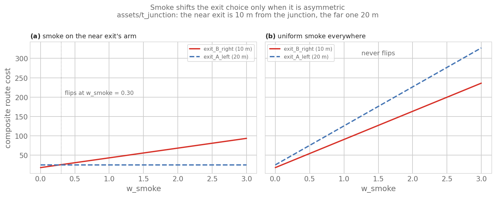

# T-junction test: smoke-blocked T-corridor

This scenario was built to exercise speed reduction, FED incapacitation and
dynamic rerouting. In the run at `c619a046` (defaults, so no irritant
slowdown) speed reduction and FED act; rerouting acts once: one agent
changes exit on the way. See the results below
and [#195](https://github.com/PedestrianDynamics/pyFDS-Evac/issues/195).

## Geometry

A T-shaped corridor where agents spawn in a dead-end branch and must
walk through the fire zone to reach either exit.

```
  Exit A ←─── 20 m ───┬─── 10 m ───→ Exit B
  (left)               │ fire          (right)
                       │ at junction
                  ┌────┴────┐
                  │  agents  │  6 m wide
                  │  spawn   │  10 m deep
                  └─────────┘
```

- Horizontal corridor: 30 m x 3 m (y = 10 to 13)
- Vertical branch: 6 m x 10 m (x = 17 to 23, y = 0 to 10)
- Exit A at x = 0 (20 m from junction)
- Exit B at x = 30 (10 m from junction)
- `config.json` and `config_full.json` add 200 agents in the branch over
  0–400 s (0.5 per second), so 150 have entered at the 300 s limit;
  `config_initial_pre*.json` place 100 agents there at t = 0

## Fire setup (t_junction.fds)

A 2 MW PVC-cable fire at the junction produces heavy soot and toxic
gases. The fire ramps up over 60 seconds.


| Property | Value |
|----------|-------|
| Fuel | PVC monomer C2H3Cl, explicit lumped reaction |
| Peak HRR | 2 MW (1000 kW/m^2 x 2 m^2) |
| Soot yield | 0.172 |
| CO yield | 0.150 (under-ventilated) |
| HCl yield | 0.583 (all the chlorine) |
| HCN yield | none -- PVC carries no nitrogen |
| Ramp-up | 0 to 100% over 60 s |
| Ceiling height | 3 m |
| Grid | 0.25 m (120 x 52 x 12 cells) |

## FDS slice outputs

Horizontal slices at z = 2 m (head height):

| Slice quantity | Used by |
|----------------|---------|
| Extinction coefficient | Smoke-speed model |
| Carbon monoxide volume fraction | FED (CO narcosis) |
| Carbon dioxide volume fraction | FED (hyperventilation factor) |
| Oxygen volume fraction | FED (hypoxia) |
| Hydrogen cyanide volume fraction | FED (CN narcosis) |
| Hydrogen chloride volume fraction | FED (irritant) |
| Visibility | fds-viewer visualization only |

## What each feature does here

**Speed reduction.** Agents approaching the junction encounter
increasing extinction, reducing their walking speed via the
Frantzich-Nilsson correlation.

**FED incapacitation.** The 6 m branch narrows to a 3 m corridor,
creating a bottleneck at the junction. Agents queuing in heavy smoke
accumulate CO and HCl exposure. The high HCl yield from PVC drives the
irritant term, while CO and O2 depletion contribute to narcosis. Measured
over 150 agents at 2 MW: largest FED per agent median 0.10 and max 0.24,
largest FIC per agent median 7.4 (interquartile 5.5-17.1) against a
threshold of 1.0, no agent incapacitated by the probabilistic per-agent
thresholds, and 97 of 150 out within 300 s against 145 in clear air. With
`--enable-fic-speed` 35 of 150 get out and two agents are incapacitated.

**Rerouting.** Exit B is initially closer (10 m vs 20 m), and in clear
air every agent takes it. In the fire, 17 of the first 35 agents, spawned
in the first 70 s, head for Exit A from spawn and leave by it. Agent 48,
spawned at 94 s, heads for Exit A and switches to Exit B at 104 s, when
both routes are refused (`fallback`). Every other agent that gets out
leaves by Exit B.

Measured at `c619a046` with the command below, run on `config_full.json`
(`--scenario assets/t_junction/config_full.json`, default seed) against the
FDS output in the project's data store (`t_junction/fire_2MW_PVC/`); the
clear-air run drops `--fds-dir`, and the FIC run adds `--enable-fic-speed`.
The figures of `7a3617d` (90 of 150 out, FED max 0.33, two incapacitated,
23 of the first 26 agents to Exit A, no exit change) predate the 0.5.0
routing and sampling changes.

`config_initial_pre0.json`, `config_initial_pre30.json` and `config_initial_pre60.json` place 100 agents over the branch at t = 0 with a constant pre-movement of 0, 30 or 60 s and a 270 s limit; see [Evacuation with and without the fire](../../docs/howto-with-without-fire.md).

## Running

1. Run the FDS simulation:

```bash
fds assets/t_junction/t_junction.fds
```

2. Run the evacuation:

```bash
uv run python run.py \
  --scenario assets/t_junction \
  --fds-dir assets/t_junction \
  --incapacitation-mode probabilistic \
  --enable-rerouting \
  --reroute-interval 5 \
  --output-smoke-history smoke.csv \
  --output-fed-history fed.csv \
  --output-route-history routes.csv
```

## Smoke-weight sweep: when does smoke actually change the exit?

`tests/test_rerouting_smoke_sweep.py` drives this asset's geometry through the
composite cost at a range of `w_smoke`, without needing FDS output.

The T puts exit B 10 m from the junction and exit A 20 m, so **distance alone
always prefers B**. With heavy extinction on B's arm:

| `w_smoke` | best exit | cost A | cost B |
|---|---|---|---|
| 0.0 | `exit_B_right` | 25.16 | 18.16 |
| 0.5 | `exit_A_left` | 25.16 | 30.73 |
| 1.0 | `exit_A_left` | 25.16 | 43.30 |
| 5.0 | `exit_A_left` | 25.16 | 143.87 |

The crossover is at **`w_smoke` ≈ 0.28**. Note that cost A never moves: smoke
charges only the route that passes through it.

### The control that matters

Under **uniform** smoke the choice never flips, at any weight. Uniform
extinction scales both routes by the same factor, so the shorter one stays
cheaper. Without this control, "smoke changed the exit" would be
indistinguishable from "a large cost term changed the exit" — the flip has to
require *asymmetric* smoke, and it does.

```bash
.venv/bin/python scripts/generate_smoke_weight_sweep.py
```



The tests deliberately pass no cognitive map, so the whole graph is visible and
knowledge cannot confound the cost question. Familiarity is exercised by
`familiarity_test_*` and by `assets/exit_visibility_alpha`.
