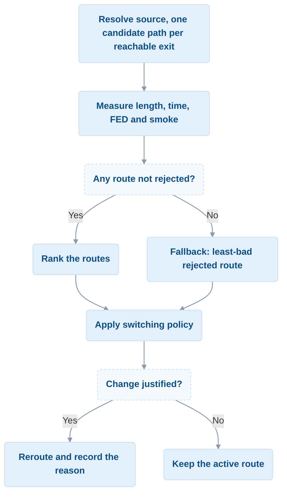

> [!NOTE]
> This page shows the routing model at work: its machinery, API and data
> structures. For its definition, parameters and defaults, see
> [Models › Dynamic route rerouting](/models/routing.md).

> Part of [pyFDS-Evac](../README.md).

The pyFDS-Evac routing system implements dynamic, smoke-aware path
planning. Agents evaluate candidate routes against the current hazard
fields and periodically reroute as conditions change. Costs are
recomputed at each reevaluation tick, so the chosen path adapts as
conditions evolve.

> **Which model is running.** Two cost models exist, selected per deck
> with `routing.cost_model`. The **default is `"gate"`**: the route's
> optical depth `K_ave * L` decides which exits stay available and
> orders the survivors, with travel time as tie-break. The historical
> `"additive"` model, in which smoke is a toll per metre, is still
> available. This page covers the machinery both share; the
> gate itself is documented in
> [route-cost-gate.md](route-cost-gate.md).

> **Note:** The cost model supports both smoke and FED (toxic gas)
> terms. FED-based route cost is active when a `fed_model` is
> provided to `run_scenario`; otherwise `fed_rate_sampler` is `None`
> and only smoke influences route ranking.

## Stage graph

Routes are evaluated on a `StageGraph` -- a directed weighted graph
where nodes represent stages (distributions, checkpoints, exits).
The graph is built once at simulation start from the scenario
configuration.

```python
from pyfds_evac.core.route_graph import StageGraph

graph = StageGraph.from_scenario(
    direct_steering_info=stage_info,   # stage_id -> {polygon, stage_type}
    transitions=transitions,           # [{from, to}, ...]
    distributions=distributions,       # optional spawn areas
    walkable_polygon=walkable_polygon, # optional Shapely Polygon
)
```

### Graph construction without a journey

When a scenario defines no `transitions`, the stage graph wires itself by
stage type: spawn areas and crossings reach every crossing and every exit,
exits are terminal, and nothing points back at a spawn area. Crossings
therefore participate in cost-driven routing without a hand-authored journey.
In clear air the direct spawn-to-exit edge is cheapest, so agents take the
nearest exit and crossings sit inert; smoke can make a route through a
crossing cheaper.

Explicit `transitions` remain authoritative and skip this path entirely.

### Edge geometry

Edges carry a polyline that follows the corridor geometry computed
by JuPedSim's `RoutingEngine` at graph construction time. Smoke
and FED are sampled along this polyline, not along a straight
centroid-to-centroid ray. Edge weight is the polyline arc length.

When no walkable polygon is provided (e.g. in unit tests), edges
fall back to a straight centroid-to-centroid ray.

### Shortest-path queries

The graph provides Dijkstra-based shortest-path queries to find
reachable exits. When dynamic weights are provided, Dijkstra uses
smoke/FED-adjusted costs instead of static arc lengths:

```python
# All reachable exits with costs and paths
paths = graph.shortest_paths_to_exits(source="dist_1")

# Nearest exit only
result = graph.shortest_exit(source="dist_1")
if result:
    exit_id, cost, path = result
```

## Route cost evaluation

Each candidate route is scored by evaluating its segments (edges)
against current smoke conditions. The cost model combines path
length and smoke exposure (FED terms are supported but not currently
active — see note above).

### Segment evaluation

For each segment (edge between two stages), the system performs
the following steps:

1. Sample the extinction coefficient K along the edge polyline
   and take its mean (see [Line-of-sight extinction](#line-of-sight-extinction)).
2. Compute the smoke-adjusted speed factor from the mean K with the
   linear speed law, using the router's own `alpha`, `beta` and
   `min_speed_factor` (see the [smoke-speed model](/models/smoke-speed.md)).
3. Estimate the travel time from the segment length and reduced
   speed.
4. Optionally, estimate the FED growth along the segment from the
   FED rate at the polyline midpoint (by arc length) and the
   estimated travel time. (Active only when a `fed_model` is
   provided; otherwise `fed_rate_sampler` is `None`.)

### Line-of-sight extinction

The mean extinction along an edge is computed from its polyline. Each
segment `s` of length `L_s` is sampled at evenly spaced points, both ends
included, at most `sampling_step_m` apart, and `K_bar_s` is the mean of
those samples. The segment means are combined weighted by length:

```
sigma_bar = sum(L_s * K_bar_s) / sum(L_s)
```

so the result approximates the line integral of K divided by the edge
length and does not depend on where the polyline has its vertices.
Zero-length segments carry no weight. The worst sample over all
segments is kept as `k_max`. This is the discrete form of the Beer-Lambert
path-integrated mean of
[Boerger et al. (2024)](https://doi.org/10.1016/j.firesaf.2024.104269),
Eq. 8-9; the Beer-Lambert law itself is on
[Extinction coefficient](/fundamentals/extinction.md).

### Arrival-time pricing

The path search (`_generate_candidates`) weights every edge with the
smoke at decision time and finds one path to each exit from the agent's
position. Its first legs are the walks from the agent to each successor of
its origin node and to its current target, weighted by the smoke on each walk
(`_first_hops`); it never routes back through the origin node. With `anticipate` (default `true`, and **independent of
`cost_model`**), every smoke sample on that path is then read at the time
the agent would reach it (`_measure_route`, `_ForesightClock`):

```
t(p) = now + min(s(p) / base_speed_m_per_s, foresight_horizon_s)
```

`s(p)` is the walk from the agent's position to the sample `p`: the walk to
the next node through the walkable area, then the node legs. Without an
agent position it starts at the route's first node. Every leg is sampled
this way, so the cost does not jump when the agent passes a node (#650;
reading each edge at its start did, since the first leg starts where the
agent stands). The sample positions are those of the decision-time
measurement; only their times differ. The FED rate of an edge stays one
sample, at its midpoint, read at `t` of the edge's start.

The unimpeded `base_speed_m_per_s` is used, not the smoke-reduced speed.
`foresight_horizon_s` defaults to infinity. A time past the earliest last
frame of the extinction and FED slices routing reads is held at that frame,
with one warning per run: there is no record to foresee beyond it (#666). The decision time itself is
not held, so the horizon check on the agent's own samples still applies.

### Composite cost

The composite is the additive model's ranking number. It is still
computed and reported under the gate, where it does not rank:

```
composite = effective_length * (1 + w_smoke * K_ave) + w_fed * FED_max
```

where:

- `effective_length` is the route length measured from the agent's own
  position when one is supplied, otherwise the node-to-node path length
- `K_ave` is the length-weighted average extinction along the route
- `FED_max` is the projected cumulative FED at route completion
- `w_smoke` and `w_fed` are configurable weights

Exposure on the part of the first segment the agent has already walked
is credited out of `K_ave` and `FED_max`, because it is already carried
in `current_fed`. For `k_max_route` and `k_leg_max` the first segment is
resampled along the walk from the agent to its next node: the routing
engine's path through the walkable area, or the straight line when no
engine is available, sampled every `sampling_step_m` along its length.

### What each model ranks on

Both models write a single `rank_cost` field, which ordering, the
exit-switch anchor and the same-exit path test all read:

| model | `rank_cost` | sort key |
|---|---|---|
| `"gate"` | `travel_time_s + w_queue * queue_time_s` | `(rejected, tier, tau, rank_cost, hops)` |
| `"additive"` | `composite_cost` | `(rejected, tier, 0.0, rank_cost, hops)` |

Under the gate the route's optical depth `tau = K_ave * L` leads the sort and
`rank_cost` breaks ties; under the additive model the `tau` slot is a constant
and `rank_cost` decides alone. The `tau` in the key is scaled by
`current_exit_discount` (0.9) for the exit the agent already heads for.

`rank_cost` is still what the exit-switch anchor and the same-exit path test
compare — a travel time under the gate. That the ordering and the anchor read
different quantities is a known defect; see
[route-cost-gate.md](route-cost-gate.md#known-limitations).

`tier` is 0 for every route unless `clean_extinction_threshold > 0` under the
gate, which is not the default; then a route whose smokiest leg is at or below
the threshold takes tier 0 and every other route takes tier 1. See
[the clean-exit tier](route-cost-gate.md#the-clean-exit-tier-off-by-default) for
what it does and why it ships off.

### Route rejection

A route is rejected under any of these conditions:

- `FED_max` exceeds `fed_rejection_threshold` (default 1.0) —
  evaluated per route inside `evaluate_route`. The threshold is
  asymmetric: a route to an exit that is *not* the agent's current one
  must come in under `fed_rejection_threshold * fed_return_margin`
  (0.9), so an agent flees a deadly exit at once but only switches onto
  a rival that is clearly safe.
- **Gate model only:** the route's optical depth `tau = K_ave * L_eff` exceeds
  `tau_max` (default 6). This test is asymmetric too: for an exit that is not
  the agent's current one the budget is `tau_max * tau_return_margin` (0.8), so
  switching needs a cleaner route than staying. `K_ave` is the length-weighted
  mean over the route's own polyline, and every exit is judged on it — see
  [route-cost-gate.md](route-cost-gate.md#optical-depth-what-it-measures-and-what-it-does-not).
  The rejection reason reads `tau 8.41 > 6.00 (K_ave 0.145 x 58.0 m)`.
- **Additive model only:** **all** of its segments have K ≥
  `visibility_extinction_threshold` **and** at least one other route has at
  least one visible segment — evaluated as a second pass in `rank_routes` after
  all routes are scored. This pass is skipped under the gate, where it was a
  second, hysteresis-free smoke criterion on top of the optical-depth test.

The last condition means a smoky-but-short route is only rejected
when a cleaner alternative exists. If every route is fully obscured,
none are visibility-rejected.

If all routes end up rejected, the least-bad one is un-rejected as a
fallback so the agent always has a path, and its reason is prefixed
`fallback: `. A route the agent must flee (FED-lethal, or impassably
smoky under the additive model) orders behind every route it need not
flee, and the current exit never holds against such a rival when it is
the one to flee ([#128](https://github.com/PedestrianDynamics/pyFDS-Evac/issues/128)). Among the rest, under the gate the least-bad route is the one with the
lowest undiscounted `tau_route`, then the lowest `rank_cost`, with
`fallback_switch_margin` hysteresis on `tau_route`: the current exit stays
first unless the rival's `tau` is more than that fraction lower ([#458](https://github.com/PedestrianDynamics/pyFDS-Evac/issues/458)). Under the
additive model the same order and hysteresis apply. A switch straight back to the exit the agent just left, when both that switch and the return are between two refused routes, is blocked for `fallback_return_lockout_s` (10 s) after the first switch; a feasible route on either side, must-flee and a third exit are not blocked. Must-flee overrides the lockout: if the predicted dose of each exit crosses its limit in turn, the agent switches on every reevaluation ([#128](https://github.com/PedestrianDynamics/pyFDS-Evac/issues/128)) ([#458](https://github.com/PedestrianDynamics/pyFDS-Evac/issues/458); the underlying sampling cause is [#653](https://github.com/PedestrianDynamics/pyFDS-Evac/issues/653)).

Rejections are never remembered. Each tick re-decides from the current
field, which is what lets the optical-depth criterion relax as an agent
closes on an exit — the distance in `tau` is the distance that remains.

### Configuration

`RouteCostConfig` controls all cost evaluation parameters. Most fields are
also readable from a scenario's `routing` block via
`RouteCostConfig.from_routing_params`. The defaults are on the
[routing model](/models/routing.md#parameters) page, and the full JSON key
table is in [route-cost-gate.md](route-cost-gate.md#configuration).

```python
from pyfds_evac.core.route_graph import RouteCostConfig

# Fields not passed keep their defaults (see the routing model page).
config = RouteCostConfig(
    cost_model="gate",  # "gate" (default) or "additive"
    w_queue=0.03,       # override: turn the congestion term on (default off)
)
```

`alpha`, `beta` and `min_speed_factor` are the router's copy of the linear
speed law, used only to estimate travel time; their defaults are on the
[routing model](/models/routing.md#parameters) page.

Two further fields exist on the dataclass but are **not** readable from
the `routing` block, so a scenario run always gets their defaults:
`fed_return_margin` (0.9) and `impassable_extinction_threshold` (3.0).

`w_smoke` and `w_fed` **no longer reach route choice under the gate.**
Since `0d9bf79` a gate run weights each Dijkstra edge by its own optical
depth, `k_avg * length` (plus a `1e-6 * length` floor that keeps a
clear-air graph from collapsing to all-zero weights). The composite is
still computed and reported; it does not rank, and it no longer picks
the path either. Under `"additive"` both weights are active as before.

### Congestion-aware routing

When `w_queue > 0`, an exit-congestion term enters the ranking. Under
the additive model it is converted to distance and added to the
composite:

```
queue_time     = N_exit / capacity
queue_distance = base_speed_m_per_s * queue_time
composite = path_length * (1 + w_smoke * K_ave)
          + w_fed * FED_max
          + w_queue * queue_distance
```

Under the gate the ranking number is a time, so the delay is added as a
time instead — `rank_cost = travel_time_s + w_queue * queue_time_s`.
Opting into congestion-aware routing therefore works under both models,
but `w_queue` is not the same quantity in the two: the additive form
carries the extra `base_speed_m_per_s` factor.

where:

- `N_exit` is the number of agents currently targeting that exit
- `capacity` is the exit's `capacity_agents_per_s` (default 1.3)
- `base_speed_m_per_s` converts queueing delay (seconds) into
  distance-equivalent cost (metres) so all terms share the same
  unit space

The queue term is applied at route-level ranking (Phase 3) only,
not in Dijkstra edge weights, because it is a per-exit constant
that cannot change which path is selected to a given exit.

**Congestion-aware routing is off by default** (`w_queue = 0`); set it in a
scenario's `routing` block to switch it on.

#### Why it is opt-in, and what 0.024 means

The term is `w_queue * v0 * N / c` with `N` a **global** tally of every agent
targeting the exit — where `v0` is the `base_speed_m_per_s` conversion constant
(not any agent's desired speed) and `c` is the exit's `capacity_agents_per_s`,
falling back to `default_exit_capacity`. With both at their 1.3 defaults the
penalty is simply
`w_queue * N` metres, so it grows without bound in the population while the
path-length differences it competes against are fixed by the geometry:

| N | `w_queue = 1.0` | `w_queue = 0.03` |
|---|---|---|
| 25 | 25 m | 0.8 m |
| 50 | 50 m | 1.5 m |
| 333 | 333 m | 10 m |

No constant is right at more than one crowd size. 1.0 puts 333 m on a door at
Station scale; the 0.03 that fixes that is inert in an ordinary room. So the
library ships no congestion weight at all, and the calibrated value lives with
the deck it was calibrated on. Issue #89 tracks replacing the global `N` with a
queue the agent can perceive, which would remove the scale dependence.

**`assets/station_fahy` currently ships `w_queue = 0.024`, not 0.03.** The 0.03
below was swept against a geometry whose doorways were narrower than the
building's; when the doorways were opened to their clear width the same sweep
scored 0.03 at 50.2 % and 0.024 at 53.0 % (seeds 420–422) against Fahy's 52.9 %.
The reasoning in this section is unchanged — only the fitted number moved.
Rerun at `8bda7f7`, under the gate and with per-agent draws seeded from the
spawn key, the same sweep scores 0.03 at 31.4 % and 0.024 at 33.4 % (31.6 % and
34.1 % on main at `7a3617d`): the deck no longer reproduces Fahy's split, and
has not been re-fitted. With the opening exit ranked from each agent's position
(#350), the sweep scores 0.03 at 33.0 % and 0.024 at 34.8 % (32.6 % and 35.0 %
on main at `81726ea`), within the spread between seeds. With every exit priced
from the agent's position (#451; `2a94a8da`, the head of its branch, not on
main) it scores 0.03 at 33.2 % and 0.024
at 34.7 %, run for run the same as main at `22beb01c`: the deck has no fire.
The sweep was not run again for 0.4.0.

**Two further caveats on that number.** The sweep was run under the additive
composite, where `w_queue` multiplies a *distance*
(`w_queue * base_speed_m_per_s * queue_time`). Under the default gate model it
multiplies a *time* (`w_queue * queue_time_s`, against travel time), which is a
different quantity, and no deck pins `cost_model` — so the Station deck now runs
under the gate with a weight fitted under the additive model. It has not been
re-fitted there.

#### Provenance of the Station's queue weight

Calibrated, not conventional. The table below is the original sweep, which
selected 0.03; see the caveats above for why the deck now ships 0.024 and why
neither value has been re-fitted under the gate cost model.
`scripts/sweep_queue_weight.py` sweeps the
weight on `assets/station_fahy` with rerouting on, three seeds per
point, and scores each run with that asset's own `validate.py`. The
front-door share falls monotonically with `w_queue`:

| `w_queue` | front-door share | mean row deviation |
|---|---|---|
| 0 | 65.9 % | 18.2 % |
| **0.03** | **53.3 %** | **17.9 %** |
| 0.05 | 48.4 % | 18.0 % |
| 0.1 | 44.9 % | 18.9 % |
| 1.0 | 22.9 % | 21.8 % |

Fahy, Proulx & Flynn measured 52.9 % of door users at the front door,
so `w_queue = 0.03` reproduces the Station's aggregate exit split and
the previous default of `1.0` did not. The mean per-row deviation is
also lower, but it is nearly flat across 0.02–0.05 (17.1–18.0 %) while
the front-door share swings 58.1 % → 48.4 %, so the row structure
confirms that low weights beat 1.0 without discriminating 0.03 within
that band. The value is fixed by the aggregate target alone.

**This calibration holds at one crowd size.** The term is
`w_queue * v0 * N / c` (`v0`, `c` as above) with `N` a global tally, so its
magnitude
relative to the path-length differences it competes with grows linearly
with the population — 0.03 was fitted at the Station's 333 agents, and
a scenario an order of magnitude smaller wants a correspondingly larger
weight to express the same preference. That scale dependence is a
property of the global-`N` form rather than of this number; a queue an
agent could actually perceive would not have it.

Exit capacity can be configured per exit in the scenario config:

```json
{
  "exits": {
    "exit_1": {
      "capacity_agents_per_s": 2.5
    }
  }
}
```

When not specified, the default from
`RouteCostConfig.default_exit_capacity` (1.3 agents/s) is used.

This approach is inspired by the game-theoretic exit selection
model of Ehtamo et al. (2010), where each agent minimises
estimated evacuation time (queueing + walking). The staggered
reevaluation schedule provides natural convergence to Nash
equilibrium without explicit iteration.

## Dynamic rerouting

During simulation, agents periodically reevaluate their routes and
switch to lower-cost exits when conditions change.

### Reevaluation scheduling

Each agent has a personal time offset derived from its spawn order so
that not all agents reevaluate on the same timestep:

```
offset = ((spawn_index + 1) % steps_per_interval) * dt_s
```

`spawn_index` counts the agents spawned from the same origin (the agents
placed at t = 0, or one flow source) from 0, so the offsets of one origin are
spread evenly. Agents of different origins can share an offset.

An agent fires its **first** evaluation once `current_time >= offset`,
then fires again every `reevaluation_interval_s` thereafter. With a
10-second interval and 100 agents the load is spread uniformly across
the interval.

### Rerouting decision flow

`evaluate_and_reroute` runs once per agent per reevaluation tick. It
answers three questions in turn: which routes are available, which one is
preferred, and whether the agent should change.



The flow also ends early in three cases: a source that is not in the graph
skips the tick, a best route that is still hard-rejected is not adopted, and a
discovery agent with no known exit explores or wanders instead (see below).

| Step | Gate (default) | Additive |
|---|---|---|
| **Source** | `current_origin`, else `current_target_stage`; a source outside the graph skips the tick | same |
| **Candidates** | Dijkstra over the agent's known subgraph on each edge's optical depth at decision time (`k_avg` × length + 1e-6 × length), started at the agent's position: the first legs are the walks to the source's successors and to the current target, each weighted on its own smoke, and no edge back into the source is taken (not when the source is an exit or without a position); one path per exit, alternatives to the same exit are not tried ([#185](https://github.com/PedestrianDynamics/pyFDS-Evac/issues/185)); the current exit's entry is replaced by the walked path when that path orders ahead | Dijkstra on each edge's share of the composite at decision time (length × (1 + `w_smoke` × `k_avg`) + `w_fed` × FED growth), started at the agent's position as for the gate; one path per exit; the walked path as for the gate |
| **Rejection** | FED over the threshold (× `fed_return_margin` for a rival while a current exit is set), then τ over `tau_max` (× `tau_return_margin` for a rival); both are tested, and a route over both reports the τ reason; must-flee reads `violation_kinds`, not the reason ([#128](https://github.com/PedestrianDynamics/pyFDS-Evac/issues/128)) | FED as for the gate, no τ test; then, when at least one route not yet rejected has a visible segment, every other such route with no visible segment is rejected as `all segments non-visible` while staying feasible |
| **Ranking** | not rejected first, then tier (clean before smoky, only with `clean_extinction_threshold` > 0; the current exit's limit is divided by `clean_exit_margin`), then τ (× `current_exit_discount` for the current exit), then `rank_cost` (travel time + queue time × `w_queue`), then hops; ties keep candidate order | not rejected first, then `rank_cost` (the composite), then hops; no tier and no τ |
| **Fallback** | when every route is rejected: re-sorted by must-flee (last), then raw τ, then `rank_cost`; a must-flee current exit never holds against a rival it need not flee, nor a rival to flee displace one it need not; the current exit goes first unless the winner's τ is below the current exit's × (1 − `fallback_switch_margin`) and differs from it by more than 1e-9; the first route is un-rejected with a `fallback: ` reason, its `feasible` unchanged | same |
| **Switch, same exit** | for an agent that is not idle: the walked path is re-measured, and the agent is rerouted if the new path's `rank_cost` is below 0.9 × the walked path's, or if the walked path is rejected and the new one is feasible and not rejected (`better_path`); otherwise, or if rerouting fails, it keeps walking, and the cached path is updated either way | same |
| **Switch, other exit** | the candidates ranked above the current exit are tried in order and the first the anchor accepts is taken; a rejected pick that is not a fallback ends the tick. The anchor accepts when the old exit was not ranked, or when it must be fled (a FED rejection, or a non-visible one above `impassable_extinction_threshold`). Next, between two refused routes the rival needs a τ strictly below the current exit's × (1 − `fallback_switch_margin`), more than 1e-9 apart, and nothing else decides: no clean bypass, no time anchor; a return to the exit left by such a switch waits `fallback_return_lockout_s`. For the remaining pairs the anchor accepts a clean rival when the current exit is not; otherwise an infeasible rival needs `rank_cost` < old × `exit_switch_anchor`; a feasible one is accepted if its τ is lower by more than `tau_max` × `tau_deadband`, refused if higher by more, and between those needs the same `rank_cost` ratio | only the top-ranked route is tried; the anchor accepts under the same hazard bypasses and the same rule between two refused routes, else needs `rank_cost` < old × `exit_switch_anchor` |
| **Applied** | `path_choices` rewritten along the new path, the agent retargeted to the stage after the one it last left when the new path passes that stage (the route is walked as it was priced, #445), else to its first unvisited stage, the exit and path recorded, a `RouteSwitch` recorded; if rerouting fails no `RouteSwitch` is recorded | same |

In `pyfds_evac/core/route_graph.py` the two columns are `GatePolicy` and
`AdditivePolicy`, and each row is one function:

| Step | Function |
|---|---|
| **Candidates** | `_generate_candidates`, weighting edges with the policy's `edge_weight`; the first legs are `_first_hops`; the walked path is applied in `rank_routes` (`current_path`) |
| **Rejection** | `_measure_route`, then `_assess_measurements` with the policy's `feasibility`; the K_vis pass is `apply_candidate_set_rules` |
| **Ranking** | the policy's `order_key` |
| **Fallback** | `_apply_fallback` |
| **Switch, same exit** | `_decide_same_exit` |
| **Switch, other exit** | `_select_candidate`, then `_decide_exit_change`; the anchor is `_anchor_allows` |
| **Applied** | `_apply_decision` |

The explore and wander decisions are made by `_decide_explore`.

Several of these rules resist switching at different points (return margins,
discount, anchor, fallback margin, same-exit threshold). Their consolidation is
[#187](https://github.com/PedestrianDynamics/pyFDS-Evac/issues/187). The
anchor's baseline is the better of the best path to the current exit from the
agent's position and the path the agent walks, by the policy's ordering
([#186](https://github.com/PedestrianDynamics/pyFDS-Evac/issues/186), resolved by
[#451](https://github.com/PedestrianDynamics/pyFDS-Evac/issues/451)).

When `rank_routes` returns nothing at all — a discovery agent whose
known subgraph holds no exit — the agent is sent toward the nearest
unexplored frontier node instead of standing still (`explore`), or
patrols known nodes when its knowledge is exhausted (`wander`).

### When a switch is triggered

An exit switch is recorded when **all four** conditions hold:

1. The agent's reevaluation tick fires (staggered offset + interval).
2. `rank_routes` finds a best route that is not hard-rejected.
3. That best route leads to a **different exit** than the current one,
   or the agent is idle (an idle agent is routed even to its current exit).
4. It clears the exit-switch anchor, or qualifies for one of the anchor
   bypasses (old exit FED-lethal or impassably smoky; or, under the gate, a
   clean rival while the current exit is not, or a feasible rival whose τ is
   lower by more than `tau_max` × `tau_deadband`).

No switch is recorded when:

- The agent has not yet reached its offset time.
- The source node is missing from the graph (e.g., agent is in a stage not included in the routing graph).
- All routes are hard-rejected and none was un-rejected as a fallback.
- The anchor holds the agent on its current exit.
- The best route leads to the same exit and the agent is not idle —
  though the path to it may still be rewritten, which is recorded as
  `better_path`.

### Route switch reasons

Each `RouteSwitch` record includes a `reason` field:

| Reason          | Condition                                                        |
|-----------------|------------------------------------------------------------------|
| `initial`       | Agent had no previous exit assignment                            |
| `default_route` | The agent follows its default route, the journey or the nearest exit on foot ([#610](https://github.com/PedestrianDynamics/pyFDS-Evac/issues/610)): at spawn, or when the agent's known exits are all closed or unreachable |
| `fed_reroute`   | A different exit: the route to the old exit is over the FED limit (whatever else refuses it), or (`additive`) the dose term contributes to a switch the hazard terms are needed for |
| `smoke_reroute` | A different exit: the route to the old exit is refused on smoke alone (τ, or non-visible under `additive`); under `gate` the new route is clean where the old one is not, lower in τ by more than the deadband, or would not clear the anchor with clear-air travel times; under `additive` the switch needs the smoke term and not the dose term |
| `exit_closed`   | The agent's exit has closed on its schedule; the best open exit it knows |
| `exit_opened`   | A different exit, closed at the agent's previous evaluation |
| `learned_exit`  | A different exit, not in the agent's cognitive map at its previous evaluation |
| `congestion`    | A different exit; the switch would not clear the anchor without the queue term |
| `shorter_path`  | A different exit; time (`gate`) or length (`additive`) alone clears the anchor |
| `exit_unreachable` | A different exit; the old exit has no route from where the agent stands |
| `resume`        | An idle agent is routed to the exit it already holds |
| `fallback`      | Best route was un-rejected as fallback (all routes rejected)     |
| `better_path`   | Same exit, but a path more than 10 % cheaper on `rank_cost`, or a feasible path replacing a rejected walked one |
| `explore`       | No exit known yet; heading to the nearest unexplored frontier    |
| `wander`        | Knowledge exhausted; patrolling known nodes                      |
| `return`        | No exit known; walking back over known legs to a node with a known exit (`no_known_exit: "return"`) |
| `stay`          | No exit known; standing until one becomes known (`no_known_exit: "stay"`) |

For a change of exit the first of these that applies names the cause:
`fallback`, `initial`, `exit_closed`, `fed_reroute`, `smoke_reroute`,
`exit_opened`, `learned_exit`, `congestion`, `shorter_path`. A route to the
old exit that is refused gives `fed_reroute` when its predicted dose is over
the limit, else `smoke_reroute`. With no route to the old exit, and for an
idle agent routed to its own exit, `exit_opened` and `learned_exit` still
come first, then `exit_unreachable` or `resume`.

A cost term is credited when the switch would not clear the anchor without
it; the anchor is strict, so a cost of exactly the old cost times
`exit_switch_anchor` does not clear. Under `gate` the smoke test also
compares clear-air travel times (queue term kept): a switch that a slowed old
route alone makes quicker is `smoke_reroute`. Under `additive` the dose and
smoke terms are first removed together: if the switch still clears, neither is
credited. If it does not, the dose is credited (`fed_reroute`) when the dose
term alone suffices or the switch fails without it, else the smoke
(`smoke_reroute`); so two redundant hazards credit the dose. The dose term
here is `w_fed` times the dose each route adds, not its `FED_max`: the dose
already taken is the same on both routes, and under the ratio anchor
removing it would hide a switch the added dose made. `learned_exit`
compares with the agent's map at its previous evaluation, or at spawn before
the first. The order of `SWITCH_REASONS` is not this precedence.
The label is read from the routes already priced and does not change the
decision. `RouteSwitch` and `SWITCH_REASONS` in `route_graph.py` list the same
values.

### Segment caching

Route evaluation supports an optional `cached_segments` dictionary.
When provided, segment costs are cached by `(source, target)` key and
reused across route evaluations within the same timestep. This avoids
redundant extinction sampling when multiple candidate routes share
segments. Under `anticipate` the same edge on two routes is priced at
two different arrival times, so the route measurement (`_measure_route`)
keys on `(source, target, arrival_time_s, limit)`, the exact time the agent
reaches the edge and the latest time any sample may be read at,
`min(now + foresight_horizon_s, max(now, last FDS frame))`. Every sample on
the edge is read at a time fixed by those two (#650), so an entry is what a
fresh measurement would give. A run uses one cache per decision time: the
reroute pass clears it each pass and the opening choice of the agents placed
at t = 0 shares one; a flow spawn ranks without it. The path search keeps
the `(source, target)` key, since it prices every edge at decision time. The walks from the agent
to the first nodes of its routes are deliberately not cached there: they belong
to one agent's position, and the cache is shared across agents in a pass. They
are cached per agent and call instead (`_first_leg`).

```python
cache: dict[SegmentCacheKey, SegmentCost] = {}
ranked = rank_routes(
    graph, source, time_s, current_fed,
    extinction_sampler, fed_rate_sampler, config,
    cached_segments=cache,
)
```

## Data structures

The routing module uses two main data structures for cost reporting.

### `SegmentCost`

Cost breakdown for one edge of a route:

| Field           | Type    | Description                             |
|-----------------|---------|-----------------------------------------|
| `source`        | `str`   | Source stage ID                         |
| `target`        | `str`   | Target stage ID                         |
| `length_m`      | `float` | Segment length (polyline arc length)     |
| `k_avg`         | `float` | Mean extinction along the segment       |
| `speed_factor`  | `float` | Speed multiplier from smoke law         |
| `travel_time_s` | `float` | Estimated travel time                   |
| `fed_growth`    | `float` | Estimated FED increase                  |
| `visible`       | `bool`  | Whether `k_avg` is below `visibility_extinction_threshold` |
| `k_max`         | `float` | Worst extinction sampled on the segment |
| `arrival_time_s`| `float` | Time the agent would reach the segment's start; its FED rate is read then (see anticipation) |

### `RouteCost`

Full cost evaluation for one candidate route:

| Field              | Type                | Description                       |
|--------------------|---------------------|-----------------------------------|
| `exit_id`          | `str`               | Target exit stage ID              |
| `path`             | `list[str]`         | Stage IDs from source to exit     |
| `path_length_m`    | `float`             | Total path length                 |
| `k_ave_route`      | `float`             | Length-weighted mean extinction    |
| `travel_time_s`    | `float`             | Total estimated travel time       |
| `fed_max_route`    | `float`             | Projected cumulative FED          |
| `composite_cost`   | `float`             | Additive cost; reported but not ranking under the gate |
| `rank_cost`        | `float`             | The number ordering, the anchor and the same-exit test read |
| `segments`         | `list[SegmentCost]` | Per-segment breakdowns            |
| `queue_time_s`     | `float`             | Estimated queueing time at exit   |
| `k_max_route`      | `float`             | Worst extinction anywhere on the route. Reported only |
| `tau_route`        | `float`             | Route optical depth `k_ave_route * effective_length` (gate). Refuses the route, orders the survivors, and orders the all-refused fallback |
| `k_leg_max`        | `float`             | Extinction of the route's smokiest leg, each leg taken as its own mean. Decides clean-exit membership |
| `clean`            | `bool`             | Whether `k_leg_max` is within the clean-exit limit. Always `False` at the default `clean_extinction_threshold = 0.0` |
| `feasible`         | `bool`              | Optical depth and dose both allow the route (gate) |
| `rejected`         | `bool`              | Whether route was rejected        |
| `rejection_reason` | `str \| None`       | Reason for rejection; `fallback: ` prefix when un-rejected |
| `violation_kinds`  | `tuple[str, ...]`   | Limits the route breaks, in recorded order: `"fed"`, `"tau"`, `"all_segments_non_visible"`; kept when the fallback un-rejects it. Must-flee reads these ([#128](https://github.com/PedestrianDynamics/pyFDS-Evac/issues/128)) |

`rank_cost`, `k_max_route`, `tau_route`, `k_leg_max`, `clean` and `feasible` are
all written to the route-cost CSV (`run.py --output-route-cost-history`), so the
gate's decisions can be audited from its own output. `composite_cost` is
deliberately not enough on its own: it does not rank under the gate, and the
quantity that does is `tau_route`.

## References

- [route-cost-gate.md](route-cost-gate.md) -- the gate model: the
  optical-depth criterion, the ordering, the fallback, the full `routing`
  key table, and known limitations.
- [gate-model-review-notes.md](gate-model-review-notes.md) -- provenance
  against `materials/evac.f90` and the open questions.
- [FDS+Evac](https://github.com/firemodels/fds/tree/c9da70d7a/Source) Technical Reference and User's Guide
  -- Korhonen (2021). Smoke-interaction model (Section 3.4).
- [Routing model](/models/routing.md) -- defaults and deviations from the
  literature; the published laws are on
  [Extinction coefficient](/fundamentals/extinction.md) and
  [Visibility through smoke](/fundamentals/visibility.md).
- [Boerger et al. (2024)](https://doi.org/10.1016/j.firesaf.2024.104269)
  -- Beer-Lambert integrated extinction along line of sight (Eq. 8-9),
  waypoint-based visibility maps. Fire Safety Journal 150:104269.
- [Schroder et al. (2020)](https://doi.org/10.1016/j.firesaf.2020.103154) --
  A map representation of the ASET-RSET concept. Fire Safety Journal.
- Ehtamo, H., Heliövaara, S., Korhonen, T. & Hostikka, S. (2010).
  Game theoretic best-response dynamics for evacuees' exit selection.
  *Advances in Complex Systems*, 13(1), 113–134.
